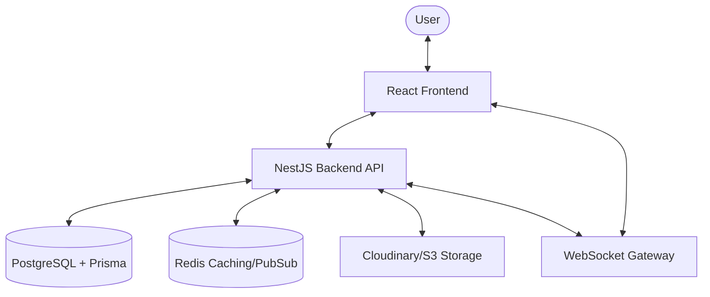
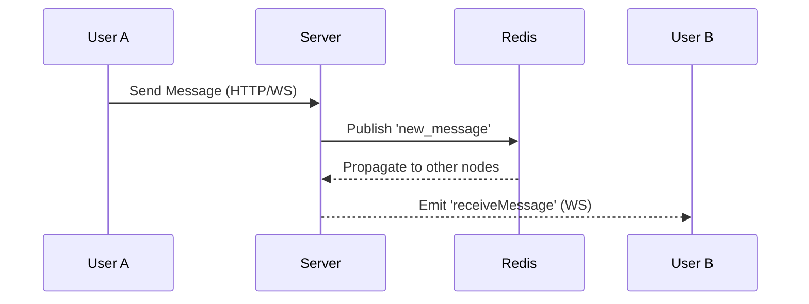

# 🌐 CircleSfera

A full-stack social media platform, built with modern technologies and best practices.

<p align="center">
  
  
  
  
  
  
  
</p>

## 📋 Overview

CircleSfera is a complete social media application that allows users to share photos, follow friends, like and comment on posts, view ephemeral stories, and receive real-time notifications. Built as a monorepo with a NestJS backend and React frontend.

## 🗂 Project Structure

```
CircleSfera/
├── circlesfera-backend/       # NestJS REST API
│   ├── README.md
│   ├── prisma/                # Database schema & migrations
│   └── src/
├── circlesfera-frontend/      # React SPA
│   ├── README.md
│   └── src/
├── circlesfera-shared/        # Shared types & utilities (partial adoption)
│   └── src/
├── circlesfera-documentation/ # Product & technical docs (see README inside)
│   └── adr/                   # ADRs planned (next documentation milestone)
├── circlesfera-landing/       # DEPRECATED / unused — do not build on this
├── e2e/                       # Playwright end-to-end tests
├── nginx/                     # Reverse-proxy templates & config
└── README.md                  # This file
```

## 🏗 System Architecture



## 🔄 Real-time Communication Flow



## ✨ Features

| Feature               | Description                                    |
| --------------------- | ---------------------------------------------- |
| 🔐 **Authentication** | JWT-based auth with access/refresh tokens      |
| 👤 **Profiles**       | Customizable user profiles with bio and avatar |
| 📸 **Posts**          | Create, edit, delete posts with images         |
| 📖 **Stories**        | 24-hour ephemeral stories                      |
| 👥 **Social**         | Follow/unfollow users                          |
| ❤️ **Engagement**     | Like and comment on posts                      |
| 🔔 **Notifications**  | Real-time notification system                  |
| 🔍 **Discovery**      | Explore feed with all posts                    |

## 🛠 Technology Stack

### Backend

- **Framework**: NestJS 11.1.10
- **Database**: PostgreSQL 15+ + Prisma 7.4.0
- **Auth**: JWT with Passport
- **Validation**: class-validator
- **Testing**: Vitest 3.0.5
- **Security**: bcrypt, throttler

### Frontend

- **Framework**: React 19.2.3 with Vite 7.2.4
- **State**: Zustand 5.0.11 + TanStack Query 5.90.20
- **Styling**: Tailwind CSS 4.1.18
- **Routing**: React Router 7.13.0
- **HTTP**: Axios 1.13.4

## 🚀 Quick Start

### Prerequisites

- Node.js 20+
- PostgreSQL 15+
- npm or yarn

### Installation

```bash
# Clone the repository
git clone <repository-url>
cd CircleSfera

# Setup Shared Package
cd circlesfera-shared
npm install
npm run build
cd ..

# Setup Backend
cd circlesfera-backend
npm install
cp .env.example .env
# Edit .env with your database credentials

# Setup Database
npx prisma generate
npx prisma migrate dev --name init
npm run prisma:seed  # Optional: seed with sample data

# Start Backend
npm run start:dev

# In another terminal - Setup Frontend
cd circlesfera-frontend
npm install
cp .env.example .env

# Start Frontend
npm run dev
```

### Access the Application

- **Frontend (Dev)**: http://localhost:5173
- **Frontend (Docker)**: http://localhost:8080
- **Backend API**: http://localhost:3000

## 🐳 Docker Deployment

The easiest way to run the entire stack (Frontend, Backend, Postgres, Redis) is using Docker Compose.

```bash
# Start all services
docker compose up -d

# View logs
docker compose logs -f

# Rebuild after changes
docker compose up --build -d
```

Production (`docker-compose.prod.yml`) is deployed to an OVH VPS via GitHub Actions. **TLS terminates on the VPS host** (certs generated/renewed there); the compose nginx proxy only serves HTTP behind that host reverse proxy.

### Test Credentials (if seeded)

```
Email: user1@example.com
Password: password123
```

## 📚 Documentation

| Document                                                               | Description                                      |
| ---------------------------------------------------------------------- | ------------------------------------------------ |
| [Product & tech docs](./circlesfera-documentation/README.md)           | Indexed docs (PRD, API, schema snapshots, etc.)  |
| [Backend README](./circlesfera-backend/README.md)                      | API documentation, endpoints, security           |
| [Frontend README](./circlesfera-frontend/README.md)                    | Components, state management, styling            |

> Snapshots under `circlesfera-documentation/` (esp. Abr 2026) may lag `schema.prisma` and Nest controllers — those remain the source of truth.

## 🔧 Development

### Scripts

**Root (Biome):**

```bash
npm run check        # Biome lint + format (write)
```

**Backend:**

```bash
npm run start:dev    # Development server
npm run build        # Production build
npm run lint         # Biome lint
npm run test         # Unit tests
npm run test:e2e     # E2E tests (see also root e2e/)
```

**Frontend:**

```bash
npm run dev          # Development server
npm run build        # Production build
npm run lint         # Biome lint
npm run preview      # Preview build
```

## 📐 Best Practices Implemented

### Code Quality

- ✅ TypeScript strict mode in both projects
- ✅ Biome for linting and formatting (root `biome.json`)
- ✅ Modular architecture (NestJS modules / React components)
- ✅ Shared types via `@circlesfera/shared` (partial adoption — not all API contracts are wired through the package yet)

### Security

- ✅ HTTP-only Cookie Authentication (JWT rotation)
- ✅ CSRF Protection (double-submit cookie pattern)
- ✅ Request Rate Limiting (Throttler)
- ✅ Secure Security Headers (Helmet/CSP)
- ✅ Password hashing with Argon2/Bcrypt

### Performance

- ✅ Automatic image optimization to WebP (Sharp)
- ✅ Query caching with TanStack Query
- ✅ Redis-backed caching and WebSockets

## 📋 Backlog

### Phase 1: Core Features ✅

- [x] User authentication (Cookie-based)
- [x] User profiles
- [x] Posts CRUD (Multiple media support)
- [x] Stories
- [x] Follows
- [x] Likes
- [x] Comments
- [x] Notifications
- [x] Real-time messaging (WebSockets)
- [x] Direct messaging (Chat)

### Phase 2: Enhanced Features ✅

- [x] Media optimization service
- [x] User search (Semantic search readiness)
- [x] E2E Tests (Playwright)
- [x] Dockerization

### Phase 3: Advanced Features

- [x] Email verification & Password reset
- [x] Admin dashboard
- [x] PWA support
- [ ] Dark mode (partial / betterable — Tailwind `dark:` classes exist in places; no complete theme system yet)

## 🤝 Contributing

1. Fork the repository
2. Create a feature branch (`git checkout -b feature/amazing-feature`)
3. Commit your changes (`git commit -m 'Add amazing feature'`)
4. Push to the branch (`git push origin feature/amazing-feature`)
5. Open a Pull Request

## 📄 License

This project is intended to be distributed under the MIT License. A formal `LICENSE` file has not been added to the repository yet.

## 👥 Team

- **Development**: Full-stack development team

---

<p align="center">
  Made with ❤️ using NestJS + React
</p>
