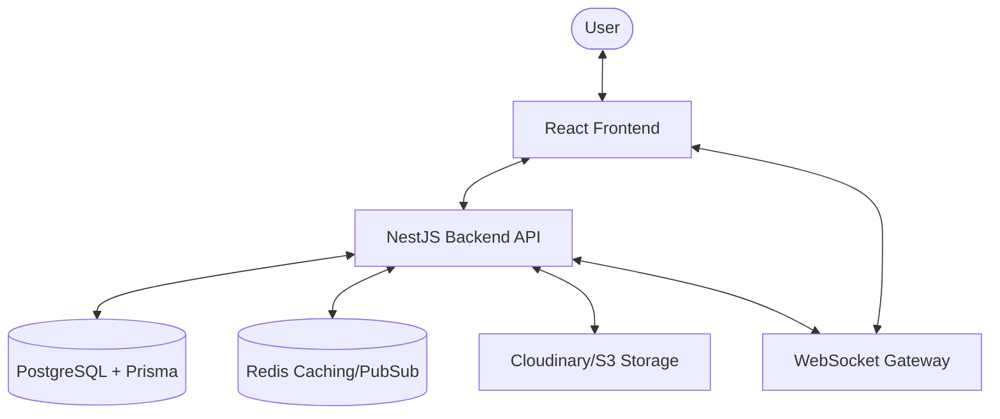
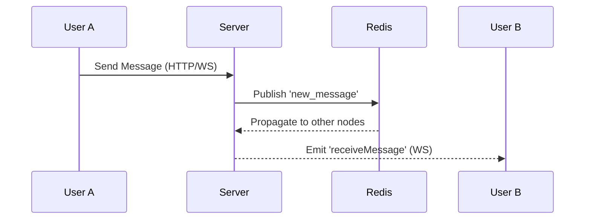

# 🌐 CircleSfera

A full-stack social media platform, built with modern technologies and best practices.

<p align="center">
  
  
  
  
  
  
  
</p>

## 📋 Overview

CircleSfera is a complete social media application that allows users to share photos, follow friends, like and comment on posts, view ephemeral stories, and receive real-time notifications. Built as a monorepo with a NestJS backend and React frontend.

## 🗂 Project Structure

```
CircleSfera/
├── .ai/                       # AI Engineering Framework (context, orchestrator, agents, playbooks)
├── .cursor/rules/             # Cursor project rules routing into .ai/
├── circlesfera-backend/       # NestJS REST API
│   ├── README.md
│   ├── prisma/                # Database schema & migrations
│   └── src/
├── circlesfera-frontend/      # React SPA
│   ├── README.md
│   └── src/
├── circlesfera-shared/        # Shared types & utilities (partial adoption)
│   └── src/
├── circlesfera-documentation/ # Product & technical docs (see README inside)
│   ├── adr/                   # Architecture Decision Records (0001+)
│   └── runbooks/              # Ops stubs (restore, rollback, incidents)
├── scripts/                   # Backup/restore, env upload, schema checks
├── circlesfera-landing/       # DEPRECATED / unused — do not build on this
├── e2e/                       # Playwright end-to-end tests
├── nginx/                     # Reverse-proxy templates & config
├── LICENSE                    # MIT
├── SECURITY.md
├── CONTRIBUTING.md
├── CODE_OF_CONDUCT.md
├── CHANGELOG.md
└── README.md                  # This file
```

## 🏗 System Architecture


```mermaid
graph TD
    User([User]) <--> Frontend[React Frontend]
    Frontend <--> API[NestJS Backend API]
    API <--> DB[(PostgreSQL + Prisma)]
    API <--> Redis[(Redis Caching/PubSub)]
    API <--> S3[Cloudinary/S3 Storage]
    API <--> Socket[WebSocket Gateway]
    Socket <--> Frontend
```

## 🔄 Real-time Communication Flow


```mermaid
sequenceDiagram
    participant U as User A
    participant S as Server
    participant R as Redis
    participant B as User B

    U->>S: Send Message (HTTP/WS)
    S->>R: Publish 'new_message'
    R-->>S: Propagate to other nodes
    S-->>B: Emit 'receiveMessage' (WS)
```

## ✨ Features

| Feature | Description |
| --- | --- |
| Authentication | HTTP-only cookie JWT + refresh rotation, CSRF, email verify / password reset, passkeys |
| Profiles & social | Profiles, follow/block/mute, bookmarks, highlights |
| Content | Posts (multi-media), Stories (24h + PPV unlock), Frames |
| Engagement | Likes, comments, mentions, real-time notifications |
| Discovery | Explore, tags, semantic search readiness (pgvector embeddings) |
| Messaging | Direct messages over WebSockets (+ Redis adapter) |
| Live | LiveKit broadcasts, co-hosts, billed gifts (Stripe) |
| Creator economy | Stripe Connect tips/unlocks/subs/promotions; 20% platform fee |
| Feed controls | Hide post/author, mute keywords (`/feed/preferences`) |
| Admin / Creator | Admin console + Creator studio |
| Trust & safety | Reports, AI moderation hooks, appeals, audit log |

## 🛠 Technology Stack

### Backend

- **Framework**: NestJS 11.1.26
- **Database**: PostgreSQL 15+ + Prisma (`@prisma/client` 7.8.0, CLI 7.6.0)
- **Auth**: JWT with Passport
- **Validation**: class-validator
- **Testing**: Vitest 4.1.9
- **Security**: argon2 / bcrypt, throttler

### Frontend

- **Framework**: React 19.2.4 with Vite 7.3.5
- **State**: Zustand 5.0.11 + TanStack Query 5.90.20
- **Styling**: Tailwind CSS 4.1.18
- **Routing**: React Router 7.18.0
- **HTTP**: Axios 1.13.2

## 🚀 Quick Start

### Prerequisites

- Node.js 24 (CI workflows and the Docker images both pin `node:24`)
- PostgreSQL 15+
- npm or yarn

### Installation

```bash
# Clone the repository
git clone <repository-url>
cd CircleSfera

# Setup Shared Package
cd circlesfera-shared
npm install
npm run build
cd ..

# Setup Backend
cd circlesfera-backend
npm install
cp ../.env.example .env   # or local backend .env.example if present
# Edit .env: DATABASE_URL, CSRF_SECRET, ENCRYPTION_KEY (message crypto),
# JWT secrets, and optional Stripe / LiveKit / OpenAI / storage keys

# Setup Database
npx prisma generate
npx prisma migrate dev
npm run prisma:seed  # Optional: seed with sample data

# Start Backend
npm run start:dev

# In another terminal - Setup Frontend
cd circlesfera-frontend
npm install
cp .env.example .env

# Start Frontend
npm run dev
```

### Important env / ops notes

- **`ENCRYPTION_KEY`**: required for message encryption at rest; see root `.env.example`. Rotating keys uses `circlesfera-backend/src/scripts/reencrypt-messages.ts` (shipped in the production image; also runnable via the manual `ops-reencrypt.yml` workflow).
- **Backups**: `scripts/backup-postgres.sh`, `scripts/backup-uploads.sh`, `scripts/restore-postgres.sh` — see [runbooks](./circlesfera-documentation/runbooks/README.md) and [11-backups-strategy.md](./circlesfera-documentation/11-backups-strategy.md).

### Access the Application

- **Frontend (Dev)**: http://localhost:5173
- **Frontend (Docker)**: http://localhost:8080
- **Backend API**: http://localhost:3000

## 🐳 Docker Deployment

The easiest way to run the entire stack (Frontend, Backend, Postgres, Redis) is using Docker Compose.

```bash
# Start all services
docker compose up -d

# View logs
docker compose logs -f

# Rebuild after changes
docker compose up --build -d
```

Production (`docker-compose.prod.yml`) is deployed to an OVH VPS via GitHub Actions. **TLS terminates on the VPS host** (certs generated/renewed there); the compose nginx proxy only serves HTTP behind that host reverse proxy.

### Test Credentials (if seeded)

```
Email: user1@example.com
Password: password123
```

## 📚 Documentation

| Document | Description |
| --- | --- |
| [AGENTS.md](./AGENTS.md) | Operating rules for AI-assisted work (highest precedence) |
| [.ai/](./.ai/README.md) | AI Engineering Framework: repo context, orchestrator, specialist roles, playbooks, checklists |
| [Product & tech docs](./circlesfera-documentation/README.md) | Indexed docs (PRD, API, status, etc.) |
| [ADRs](./circlesfera-documentation/adr/README.md) | Architecture Decision Records (LiveKit, Redis/BullMQ, auth, storage, feed, fees, …) |
| [Runbooks](./circlesfera-documentation/runbooks/README.md) | Restore / rollback / incident stubs |
| [Backend README](./circlesfera-backend/README.md) | API documentation, endpoints, security |
| [Frontend README](./circlesfera-frontend/README.md) | Components, state management, styling |
| [CONTRIBUTING](./CONTRIBUTING.md) / [SECURITY](./SECURITY.md) | Contribution and vulnerability reporting |

> Snapshots under `circlesfera-documentation/` may lag — `schema.prisma` and Nest controllers remain the source of truth. `08-schema-prisma.md` is only a pointer to the live schema.

## 🤖 AI-assisted development

AI work on this repo is governed by [`AGENTS.md`](./AGENTS.md) and operationalised by the
**AI Engineering Framework** in [`.ai/`](./.ai/README.md):

- [`.ai/core/`](./.ai/core/) — permanent project context: product identity, engineering principles, stack, architecture, conventions, quality bar, glossary, and the precedence order in [`sources-of-truth.md`](./.ai/core/sources-of-truth.md).
- [`.ai/orchestrator.md`](./.ai/orchestrator.md) — routes a request to the right playbook and specialist roles.
- [`.ai/agents/`](./.ai/agents/README.md), [`.ai/playbooks/`](./.ai/playbooks/README.md), [`.ai/checklists/`](./.ai/checklists/README.md), [`.ai/templates/`](./.ai/templates/README.md) — roles, workflows, done-gates and document skeletons.
- [`.cursor/rules/`](./.cursor/rules/) — thin Cursor rules that auto-attach the relevant `.ai/` context per file path.

Verified inconsistencies between docs and code are tracked in [`.ai/core/known-gaps.md`](./.ai/core/known-gaps.md) instead of being silently "fixed".

## 🔧 Development

### Scripts

**Root (Biome):**

```bash
npm run check        # Biome lint + format (write)
```

**Backend:**

```bash
npm run start:dev    # Development server
npm run build        # Production build
npm run lint         # Biome lint
npm run test         # Unit tests
npm run test:e2e     # E2E tests (see also root e2e/)
```

**Frontend:**

```bash
npm run dev          # Development server
npm run build        # Production build
npm run lint         # Biome lint
npm run preview      # Preview build
```

## 📐 Best Practices Implemented

### Code Quality

- ✅ TypeScript strict mode in both projects
- ✅ Biome for linting and formatting (root `biome.json`)
- ✅ Modular architecture (NestJS modules / React components)
- ✅ Shared types via `@circlesfera/shared` (partial adoption — not all API contracts are wired through the package yet)

### Security

- ✅ HTTP-only Cookie Authentication (JWT rotation)
- ✅ CSRF Protection (double-submit cookie pattern)
- ✅ Request Rate Limiting (Throttler)
- ✅ Secure Security Headers (Helmet/CSP)
- ✅ Password hashing with Argon2/Bcrypt

### Performance

- ✅ Automatic image optimization to WebP (Sharp)
- ✅ Query caching with TanStack Query
- ✅ Redis-backed caching and WebSockets

## 📋 Backlog

### Phase 1: Core Features ✅

- [x] User authentication (Cookie-based)
- [x] User profiles
- [x] Posts CRUD (Multiple media support)
- [x] Stories
- [x] Follows
- [x] Likes
- [x] Comments
- [x] Notifications
- [x] Real-time messaging (WebSockets)
- [x] Direct messaging (Chat)

### Phase 2: Enhanced Features ✅

- [x] Media optimization service
- [x] User search (Semantic search readiness)
- [x] E2E Tests (Playwright)
- [x] Dockerization

### Phase 3: Advanced Features

- [x] Email verification & Password reset
- [x] Admin dashboard
- [x] PWA support
- [ ] Dark mode (partial / betterable — Tailwind `dark:` classes exist in places; no complete theme system yet)

## 🤝 Contributing

See [CONTRIBUTING.md](./CONTRIBUTING.md) and [CODE_OF_CONDUCT.md](./CODE_OF_CONDUCT.md). Short version:

1. Fork the repository
2. Create a feature branch (`git checkout -b feature/amazing-feature`)
3. Commit your changes
4. Push to the branch and open a Pull Request

## 📄 License

MIT — see [LICENSE](./LICENSE).

## 👥 Team

- **Development**: Full-stack development team

---

<p align="center">
  Made with ❤️ using NestJS + React
</p>
