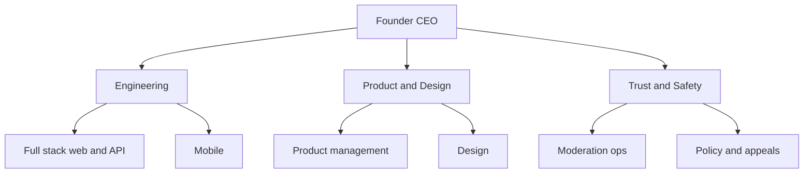

# CircleSfera
## Team and founders

**Your World, Connected.**  
August 2026

---

## Founder

**Shady Feliu** — Founder & CEO

Shady Feliu founded CircleSfera and has built the production platform to date: multi-format social product, creator commerce on Stripe Connect, trust-and-safety control plane, and continuous deployment on live infrastructure. Public users: none. The raise hires the team that scales what one founder proved in code.

**Background.** [Founder to complete: prior roles, domain expertise, relevant exits or scale experience — 1 short paragraph.]

**Why CircleSfera.** [Founder to complete: personal motivation for trust-first social and long-term company building — 1 short paragraph.]

**Why now.** [Founder to complete: why you are the person to ship this category in the next 24 months — 1 short paragraph.]

LinkedIn: [founder to complete]  
Email: [founder to complete]

---

## Team today

| Role | Person | Status |
| --- | --- | --- |
| Founder & CEO (product, engineering, trust ops interim) | Shady Feliu | Full-time |
| Engineering | — | Raise hire |
| Product | — | Raise hire |
| Trust & Safety (dedicated) | — | Raise hire |
| Design | — | Raise hire |

Trust operations today run through the founder plus the shipped Admin Panel (separate identities, MFA). A dedicated trust lead is a first-class hire, not an afterthought.

---

## First four hires (12-month plan)

Aligned with [`_internal/hiring-plan.md`](./_internal/hiring-plan.md). Trust and core product before scale marketing. One **full stack developer** owns API and web product (no separate frontend hire).

| Priority | Role | Target start | Why first |
| --- | --- | --- | --- |
| 1 | Full stack developer | M2 | API, warehouse, promotions, composer, studio, PWA web |
| 2 | Mobile engineer (iOS + Android) | M3 | Store submission; Capacitor shells exist |
| 3 | Trust & Safety lead | M4 | Reports, appeals, moderation before public opening |
| 4 | Product designer | M5 | Next creation tools and mobile-first density |

Additional hires (M7–M12): platform engineer, product manager, part-time legal/compliance counsel as needed. See hiring plan for loaded cost estimates.

---

## Advisors

| Name | Domain | Status |
| --- | --- | --- |
| [Founder to complete] | | |

No advisory board is claimed until names and roles are confirmed.

---

## Organisation after raise

Goal by M18: 8–10 people, product ready for controlled public opening, trust desk staffed daily.

---

## What investors should assess

- Can this founder ship? **Evidence:** production codebase, payments, trust desk, no invented traction.
- Can this founder hire? **Plan:** four named roles with timing; use of funds aligned.
- Can this team operate trust at scale? **Hire 3** is explicit before phase-three GTM.

Complete legal and cap table details in [18-governance.md](./18-governance.md).

CircleSfera  
Your World, Connected.
