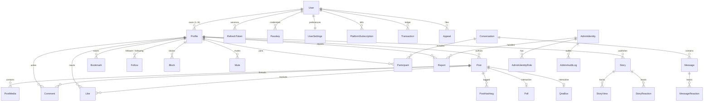

# CircleSfera: Database Architecture & ER Diagram

> **Source of Truth:** `circlesfera-backend/prisma/schema.prisma`.
> If this document conflicts with the active Prisma schema, the schema takes precedence.
> Present tense reflects shipped production models. Refer to [00-status.md](./00-status.md).

---

## 1. Architecture & Identity Separation (ADR-0015)

CircleSfera enforces a strict separation between account ownership and social personas:
- **`User`**: Manages credentials, security settings (passkeys, MFA), billing identity (`stripeCustomerId`), account status, and subscription entitlements.
- **`Profile`**: Represents the social actor (`username`, avatar, bio, follower graph). All social interactions and content foreign keys (`postId`, `commentId`, `likeId`, `followId`, `conversationId`) attach exclusively to `Profile.id` ([ADR-0015](./adr/0015-user-profile-identity-split.md)).
- **`AdminIdentity`**: Completely segregated operational identities for Admin Panel operators (`/api/v1/admin/*`), requiring MFA/TOTP and granular RBAC ([ADR-0013](./adr/0013-admin-panel-admin-identity.md)).
- **Monetary Precision**: All financial amounts are modeled strictly as integer cents (`priceCents`, `budgetCents`, `amountCents`, `Transaction.amount`). Floating-point currency representation is prohibited.

---

## 2. Core Identity & Authentication Entities

### users
- `id` (PK)
- `email` (UNIQUE)
- `password`
- `createdAt`
- `updatedAt`
- `isActive`
- `deletedAt`
- `isOnline`
- `lastSeenAt`
- `stripeCustomerId` (UNIQUE, nullable)
- `role` (`Role` enum: `USER`, `ADMIN`, `MODERATOR`)
- `emailVerified`
- `verificationToken` (UNIQUE, nullable)
- `resetToken` (UNIQUE, nullable)
- `resetTokenExpires`
- `verificationLevel` (`VerificationLevel`: `BASIC`, `VERIFIED`, `BUSINESS`, `ELITE`)
- `accountType` (`AccountType`: `PERSONAL`, `CREATOR`, `BUSINESS`)
- `currentChallenge` (WebAuthn challenge)

### profiles
- `id` (PK)
- `userId` (FK → users.id; indexed)
- `username` (UNIQUE)
- `fullName`
- `bio`
- `avatar`
- `standardUrl`
- `thumbnailUrl`
- `website`
- `location`
- `createdAt`
- `updatedAt`
- `cover`, `coverStandardUrl`, `coverThumbnailUrl`
- `isAccountBanned`
- `accountBanReason`
- `suspendedUntil`

### refresh_tokens
- `id` (PK)
- `token` (UNIQUE)
- `userId` (FK → users.id)
- `expiresAt`
- `createdAt`

### passkeys
- `id` (PK)
- `userId` (FK → users.id)
- `credentialID` (UNIQUE)
- `publicKey`
- `counter`
- `transports`
- `createdAt`

### passkey_challenges
- `id` (PK)
- `challenge`
- `userId` (FK → users.id)
- `expiresAt`
- `createdAt`

### device_signals
- `id` (PK)
- `userId` (FK → users.id)
- `visitorHash` (HMAC of visitor ID)
- `userAgentHash` (nullable)
- `firstSeenAt`, `lastSeenAt`
- UNIQUE (`userId`, `visitorHash`)
- Account trust and device risk scoring ([ADR-0014](./adr/0014-account-trust-signals.md)).

### user_settings
- `id` (PK)
- `userId` (UNIQUE, FK → users.id)
- `privacyLevel`, `contentPreference`, `blurSensitiveContent`
- `emailNotifications`, `pushNotifications`, `isOnboarded`
- `updatedAt`

### data_export_requests
- `id` (PK)
- `userId` (FK → users.id)
- `status` (`ExportStatus`: `PENDING`, `PROCESSING`, `COMPLETED`, `FAILED`)
- `downloadUrl` (nullable)
- `expiresAt` (nullable)
- `createdAt`, `updatedAt`

### push_subscriptions
- `id` (PK)
- `userId` (FK → users.id)
- `endpoint` (UNIQUE)
- `p256dh`
- `auth`
- `createdAt`

### admin_identities
- `id` (PK)
- `email` (UNIQUE)
- `passwordHash`
- `displayName`
- `status` (`AdminIdentityStatus`: `ACTIVE`, `SUSPENDED`, `PENDING_SETUP`)
- `totpSecret`, `totpEnabled`, `mfaRequired`
- `linkedUserId` (nullable FK → users.id — correlation only)
- `lastLoginAt`, `lastActivityAt`, `failedLoginCount`, `lockedUntil`
- `createdAt`, `updatedAt`

### admin_roles / admin_permissions / join tables
- `AdminRole` (`id`, `name`, `description`, `isSystem`)
- `AdminPermission` (`id`, `action`, `resource`, `description`)
- `AdminIdentityRole` (Composite PK `[identityId, roleId]`)
- `AdminRolePermission` (Composite PK `[roleId, permissionId]`)
- `AdminRefreshToken` (`id`, `token`, `identityId`, `expiresAt`)
- `AdminPasskey` (`id`, `identityId`, `credentialId`, `publicKey`, `counter`)

---

## 3. Content Publishing & Media Tier

### posts
- `id` (PK)
- `profileId` (FK → profiles.id)
- `caption`
- `createdAt`
- `updatedAt`
- `location`
- `hideLikes`
- `turnOffComments`
- `type` (`PostType`: `POST`, `FRAME`)
- `contentRating` (`ContentRating`: `GENERAL`, `MATURE`)
- `views`
- `visibility` (`Visibility`: `PUBLIC`, `FOLLOWERS`, `PRIVATE`)
- `priceCents` (integer cents; pay-per-view content)
- `audioId` (nullable FK → audio_tracks.id)

### post_media
- `id` (PK)
- `postId` (FK → posts.id)
- `url`, `standardUrl`, `thumbnailUrl`
- `type`
- `order`
- `filter`
- `altText`
- `createdAt`

### post_tags
- `postId` (FK → posts.id)
- `profileId` (FK → profiles.id)
- `x`, `y`
- `createdAt`
- UNIQUE (`postId`, `profileId`)

### hashtags
- `id` (PK)
- `tag` (UNIQUE)
- `postCount`
- `createdAt`

### post_hashtags
- `postId` (FK → posts.id)
- `hashtagId` (FK → hashtags.id)
- `createdAt`
- Composite PK (`postId`, `hashtagId`)

### post_embeddings
- `postId` (PK, FK → posts.id)
- `vector` (`vector(1536)` via pgvector)

### profile_embeddings
- `profileId` (PK, FK → profiles.id)
- `vector` (`vector(1536)` via pgvector)
- Read path: `SearchService.semanticSearchProfiles` (`GET /search/ai/profiles`). Write path: `ProfilesService` background worker on profile update; backfill via `npm run embeddings:backfill` ([ADR-0001](./adr/0001-profile-embedding-retention.md)).

### audio_tracks
- `id` (PK)
- `title`, `artist`, `url`, `thumbnailUrl`
- `duration`
- `createdAt`, `updatedAt`

### places
- `id` (PK)
- `name`
- `latitude`, `longitude`
- `address`
- `createdAt`

---

## 4. Stories & Ephemeral Content

### stories
- `id` (PK)
- `profileId` (FK → profiles.id)
- `mediaUrl`, `standardUrl`, `thumbnailUrl`
- `mediaType`
- `expiresAt` (24-hour default window)
- `createdAt`
- `isCloseFriendsOnly`
- `audioId` (nullable FK → audio_tracks.id)

### story_views
- `id` (PK)
- `storyId` (FK → stories.id)
- `viewerId` (FK → profiles.id)
- `createdAt`
- UNIQUE (`storyId`, `viewerId`)

### story_reactions
- `id` (PK)
- `storyId` (FK → stories.id)
- `profileId` (FK → profiles.id)
- `reaction`
- `createdAt`
- UNIQUE (`storyId`, `profileId`)

### highlights
- `id` (PK)
- `profileId` (FK → profiles.id)
- `title`, `coverUrl`
- `createdAt`, `updatedAt`

### highlight_stories
- `id` (PK)
- `highlightId` (FK → highlights.id)
- `storyId` (FK → stories.id)
- `createdAt`
- UNIQUE (`highlightId`, `storyId`)

### close_friends
- `id` (PK)
- `profileId` (FK → profiles.id)
- `friendId` (FK → profiles.id)
- `createdAt`
- UNIQUE (`profileId`, `friendId`)

---

## 5. Interactions & Engagement

### comments
- `id` (PK)
- `postId` (FK → posts.id)
- `profileId` (FK → profiles.id)
- `content`
- `mediaUrl`, `mediaType`
- `createdAt`, `updatedAt`
- `parentId` (nullable FK → comments.id — threaded replies)

### likes
- `id` (PK)
- `postId` (FK → posts.id)
- `profileId` (FK → profiles.id)
- `createdAt`
- UNIQUE (`postId`, `profileId`)

### comment_likes
- `id` (PK)
- `commentId` (FK → comments.id)
- `profileId` (FK → profiles.id)
- `createdAt`
- UNIQUE (`commentId`, `profileId`)

### bookmarks
- `id` (PK)
- `profileId` (FK → profiles.id)
- `postId` (FK → posts.id)
- `collectionId` (nullable FK → collections.id)
- `createdAt`
- UNIQUE (`profileId`, `postId`)

### collections
- `id` (PK)
- `profileId` (FK → profiles.id)
- `name`, `description`
- `coverUrl`, `standardUrl`, `thumbnailUrl`
- `createdAt`, `updatedAt`

---

## 6. Social Graph

### follows
- `id` (PK)
- `followerId` (FK → profiles.id)
- `followingId` (FK → profiles.id)
- `status` (`FollowStatus`: `PENDING`, `ACCEPTED`)
- `createdAt`
- UNIQUE (`followerId`, `followingId`)

### blocks
- `id` (PK)
- `blockerId` (FK → profiles.id)
- `blockedId` (FK → profiles.id)
- `createdAt`
- UNIQUE (`blockerId`, `blockedId`)

### mutes
- `id` (PK)
- `muterId` (FK → profiles.id)
- `mutedId` (FK → profiles.id)
- `expiresAt` (nullable — null = permanent; timestamp = timed mute)
- `createdAt`
- UNIQUE (`muterId`, `mutedId`)
- INDEX (`muterId`, `expiresAt`)
- Excludes the muted user's posts from `FeedService` (`foryou` and `following`) while active ([ADR-0004](./adr/0004-feed-preferences.md)).

---

## 7. Notifications

### notifications
- `id` (PK)
- `recipientId` (FK → profiles.id)
- `senderId` (nullable FK → profiles.id)
- `type` (`NotificationType`: `LIKE`, `COMMENT`, `FOLLOW`, `MENTION`, `SYSTEM`, `MESSAGE`, `TRANSACTION`)
- `content`
- `read` (boolean)
- `postId`, `storyId`, `reportId`, `messageId` (nullable FKs)
- `targetType`, `targetId`
- `createdAt`

---

## 8. Real-Time Messaging & Direct

### conversations
- `id` (PK)
- `createdAt`, `updatedAt`
- `name` (nullable)
- `isGroup` (boolean)

### participants
- `id` (PK)
- `conversationId` (FK → conversations.id)
- `profileId` (FK → profiles.id)
- `isAdmin`, `lastReadAt`, `deletedAt`, `clearedAt`
- `createdAt`
- UNIQUE (`conversationId`, `profileId`)

### messages
- `id` (PK)
- `conversationId` (FK → conversations.id)
- `senderId` (FK → profiles.id)
- `content`
- `mediaUrl`, `mediaType`
- `postId`, `storyId`, `replyToId` (nullable FKs)
- `createdAt`, `updatedAt`

### message_reactions
- `id` (PK)
- `messageId` (FK → messages.id)
- `profileId` (FK → profiles.id)
- `reaction`
- `createdAt`
- UNIQUE (`messageId`, `profileId`)

---

## 9. Monetization & Ledger Tier

### platform_plans
- `id` (PK)
- `name`, `description`
- `priceCents` (integer cents)
- `yearlyPriceCents` (nullable)
- `currency`
- `interval`
- `stripeProductId` (UNIQUE)
- `stripePriceId` (UNIQUE)
- `yearlyStripePriceId` (UNIQUE)
- `features` (JSON array)
- `isActive`
- `createdAt`, `updatedAt`

### platform_subscriptions
- `id` (PK)
- `userId` (FK → users.id)
- `planId` (FK → platform_plans.id)
- `status` (`SubscriptionStatus`: `ACTIVE`, `CANCELED`, `PAST_DUE`, `UNPAID`)
- `stripeSubscriptionId` (UNIQUE)
- `currentPeriodStart`, `currentPeriodEnd`
- `cancelAtPeriodEnd`
- `createdAt`, `updatedAt`
- UNIQUE (`userId`, `planId`)

### transactions
- `id` (PK)
- `userId` (FK → users.id)
- `amount` (integer cents; legacy column name preserved per API contract)
- `currency`
- `type` (`TransactionType`: `DIRECT_POST_UNLOCK`, `DIRECT_MESSAGE_UNLOCK`, `DIRECT_STORY_UNLOCK`, `DIRECT_LIVE_GIFT`, `PLATFORM_SUBSCRIPTION`, `PROMOTION_CHARGE`)
- `status` (`TransactionStatus`: `PENDING`, `COMPLETED`, `FAILED`, `REFUNDED`)
- `stripePaymentIntentId` (UNIQUE, nullable)
- `platformFee` (integer cents; 20% platform fee per [ADR-0010](./adr/0010-platform-fee-20-percent.md))
- `createdAt`, `updatedAt`

### post_unlocks / message_unlocks / story_unlocks
- Relational mapping of direct digital purchases:
  - `PostUnlock` (`id`, `userId`, `postId`, `pricePaid`, `createdAt`)
  - `MessageUnlock` (`id`, `userId`, `messageId`, `pricePaid`, `createdAt`)
  - `StoryUnlock` (`id`, `userId`, `storyId`, `pricePaid`, `createdAt`)

### promotions
- `id` (PK)
- `userId` (FK → users.id — billing account)
- `targetType` (`PromotionTargetType`: `POST`, `PROFILE`, `STORY`)
- `targetId`
- `budgetCents`, `dailyBudgetCents` (integer cents)
- `currency`
- `status` (`PromotionStatus`: `PENDING`, `ACTIVE`, `COMPLETED`, `REJECTED`, `CANCELLED`, `FAILED`)
- `stripePaymentIntentId` (UNIQUE)
- `refundPolicy` (`PromotionRefundPolicy`: `PROPORTIONAL`, `NONE`)
- `startDate`, `endDate`, `reach`
- `createdAt`, `updatedAt`

### stripe_payout_logs
- `id` (PK)
- `stripePayoutId` (UNIQUE)
- `userId` (FK → users.id — Connect account holder)
- `amountCents`
- `currency`
- `status`
- `arrivalDate`
- `failureReason` (nullable)
- `createdAt`, `updatedAt`
- Synced from Stripe Connect webhooks ([ADR-0002](./adr/0002-stripe-connect-payouts.md)).

### webhook_events & outbox_events
- `WebhookEvent` (`id`, `provider`, `externalId`, `payload`, `status`, `processedAt`)
- `OutboxEvent` (`id`, `aggregateType`, `aggregateId`, `eventType`, `payload`, `status`, `createdAt`)

---

## 10. Interactive & Live Streaming Tier

### live_streams
- `id` (PK)
- `hostId` (FK → profiles.id)
- `coHostId` (nullable FK → profiles.id)
- `title` (nullable)
- `status` (`LiveStatus`: `LIVE`, `ENDED`)
- `viewerCount`
- `startedAt`, `endedAt`
- `hlsUrl`, `replayUrl`

### live_gifts
- `id` (PK)
- `streamId` (FK → live_streams.id)
- `senderId` (FK → profiles.id)
- `amountCents` (integer cents)
- `giftType`
- `stripePaymentIntentId` (UNIQUE, nullable)
- `createdAt`

### polls & poll_votes
- `Poll` (`id`, `postId` [nullable UNIQUE], `storyId` [nullable UNIQUE], `question`, `options` [string array], `createdAt`)
- `PollVote` (`id`, `pollId`, `profileId`, `optionIndex`, `createdAt`; UNIQUE `[pollId, profileId]`)

### qna_boxes & qna_answers
- `QnaBox` (`id`, `postId` [nullable UNIQUE], `storyId` [nullable UNIQUE], `prompt`, `createdAt`)
- `QnaAnswer` (`id`, `qnaBoxId`, `profileId`, `answerText`, `createdAt`)

---

## 11. Trust, Safety, Moderation & Compliance

### reports
- `id` (PK)
- `reporterId` (FK → profiles.id)
- `reason` (`ReportReason`: `SPAM`, `HARASSMENT`, `HATE_SPEECH`, `NUDITY`, `VIOLENCE`, `COPYRIGHT`, `OTHER`)
- `details` (nullable)
- `status` (`ReportStatus`: `PENDING`, `REVIEWING`, `RESOLVED`, `REJECTED`)
- `targetType` (`ReportTargetType`: `POST`, `COMMENT`, `USER`, `STORY`, `MESSAGE`)
- `targetId`
- `assignedAdminId` (nullable FK → admin_identities.id)
- `resolvedAt`, `internalNotes`
- `createdAt`, `updatedAt`

### appeals
- `id` (PK)
- `userId` (FK → users.id)
- `targetType` (`AppealTargetType`: `ACCOUNT_BAN`, `POST_REMOVAL`)
- `targetId` (nullable)
- `reason`
- `status` (`AppealStatus`: `PENDING`, `APPROVED`, `REJECTED`)
- `adminNotes` (nullable)
- `createdAt`, `updatedAt`

### admin_audit_logs
- `id` (PK)
- `adminId` (nullable FK → admin_identities.id)
- `legacyUserId` (nullable)
- `action` (`AdminAction` enum)
- `targetType`, `targetId`, `details`
- `ipAddress`, `userAgent`, `requestId`
- `createdAt`

### feed preferences (ADR-0004)
- `FeedHiddenPost` (`id`, `profileId`, `postId`, `createdAt`; UNIQUE `[profileId, postId]`)
- `FeedHiddenAuthor` (`id`, `profileId`, `targetProfileId`, `createdAt`; UNIQUE `[profileId, targetProfileId]`)
- `FeedMutedKeyword` (`id`, `profileId`, `keyword`, `createdAt`; UNIQUE `[profileId, keyword]`)

### support_tickets
- `id` (PK)
- `userId` (nullable FK → users.id)
- `email`, `subject`, `message`
- `status` (`TicketStatus`: `OPEN`, `IN_PROGRESS`, `RESOLVED`, `CLOSED`)
- `reply`, `resolvedAt`
- `createdAt`, `updatedAt`

### whitelist_entries & system_settings
- `WhitelistEntry` (`id`, `email` [UNIQUE], `name`, `status`, `createdAt`, `updatedAt`)
- `SystemSetting` (`key` [PK], `value`, `description`, `updatedAt`, `updatedBy`)

### moderation_rules & moderation_signatures
- `ModerationRule` (`id`, `keyword` [UNIQUE], `action` [`RuleAction`], `isActive`, `createdBy`, `createdAt`, `updatedAt`)
- `ModerationSignature` (`id`, `vector` [`vector(1536)`], `category`, `textPreview`, `createdAt`)

---

## 12. Entity Relational Graph & Cardinalities

---

## 13. Architectural Constraints & Relational Boundaries

1. **Strict ADR-0015 Enforcement**: No social content attaches to `User.id`. `Profile.id` is the single social FK.
2. **Financial Precision**: All monetary values are integer cents. Floating-point types are forbidden in financial tables.
3. **Platform Fee**: Fixed at 20% on all creator monetization transactions ([ADR-0010](./adr/0010-platform-fee-20-percent.md)).
4. **Moderation Traceability**: Operational moderation traceability lives directly in `Report` + `AdminAuditLog` + `Appeal` without an unmodeled `ModerationAction` table.
5. **Feed Preferences**: User content suppression operates via dedicated preference tables (`feed_hidden_posts`, `feed_hidden_authors`, `feed_muted_keywords`) and `mutes` ([ADR-0004](./adr/0004-feed-preferences.md)).
