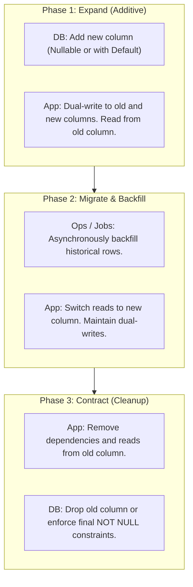

# Migration Rollback & Expand/Contract Policy — CircleSfera

> **Source of Truth:** This document defines the mandatory design, deployment, and reversal
> procedures for PostgreSQL (Prisma) database migrations in CircleSfera. It ensures that any
> application deployment can be rolled back without cascading failures caused by schema divergence.

---

## 1. Core Principle: N-1 Coexistence

In CircleSfera's continuous deployment pipeline, `prisma migrate deploy` executes during container
boot before new code receives live traffic. If an application version fails health checks and an
immediate rollback to the previous artifact (version $N-1$) is triggered, the database remains on
the newly migrated schema (version $N$).

> **Golden Rule:** Every schema change in version $N$ must be **100% backward-compatible** with
> application code running version $N-1$. No application rollback may require an immediate,
> destructive schema reversal to maintain normal operation.

---

## 2. Expand/Contract Lifecycle (Three Phases)

Any structural modification that modifies, renames, or removes existing data must be separated
into discrete phases across sequential deployments:



### Phase 1 — Expand (Deployment N)
- Add the new column as `NULLABLE` or configure an explicit database-level `DEFAULT`.
- Application code dual-writes to both fields but continues reading from the original field.
- **Rollback Safety:** If code is rolled back to $N-1$, the previous version simply ignores the new column.

### Phase 2 — Backfill & Switch (Deployment N+1)
- Execute a background job or migration script to populate historical records into the new column.
- Application code switches reads to the new column once backfilling is verified.
- **Rollback Safety:** If code is rolled back, the original column remains intact and up-to-date due to dual-writes.

### Phase 3 — Contract (Deployment N+2)
- Once verified in production that no active instances read from or depend on the legacy column, a final migration drops the obsolete column (`DROP COLUMN`) or tightens constraints.
- **Rollback Safety:** Requires confirmed operational stability prior to deployment.

---

## 3. Operations Forbidden in Single-Step Migrations

The following destructive or narrowing statements are forbidden in a single migration without following Expand/Contract:

| SQL Statement | Risk to Version $N-1$ | Required Expand/Contract Path |
| :--- | :--- | :--- |
| Direct `DROP COLUMN` | Immediate failure when version $N-1$ attempts to read or project the column. | Decouple reads in deployment $N$; drop column in deployment $N+1$. |
| `ALTER COLUMN ... RENAME` | Version $N-1$ fails instantly upon missing the old identifier. | Add new column, dual-write, backfill, and drop old column in 3 phases. |
| `ADD COLUMN ... NOT NULL` (no `DEFAULT`) | Version $N-1$ inserts records omitting the new column, violating the NOT NULL constraint. | Add as `NULLABLE` or supply an explicit database `DEFAULT`. |
| `DROP TABLE` on active entity | Prevents rollback of any version querying the table. | Remove code queries first; drop table in a subsequent release. |
| `ALTER TYPE ... DROP VALUE` | Fails if historical rows exist or if version $N-1$ emits the enum value. | Deprecate value in code; sanitize data before altering the enum type. |

---

## 4. Operational Rollback Procedures

### Strategy A: Application Rollback (Canonical & Recommended)
Adhering to Expand/Contract guarantees that routine rollbacks do not require database alterations:
1. Roll back the application container to the previous Docker image:
   ```bash
   docker compose -f docker-compose.prod.yml up -d --no-deps backend frontend
   ```
2. Verify `/api/v1/health` confirms normal responses on version $N-1$.
3. Schema $N$ continues residing in the database without generating errors or query locks.

### Strategy B: Database Schema Rollback (Critical Emergency)
If a migration introduces catastrophic table locks, index corruption, or syntax failures in production:
1. Locate the corresponding rollback script `down.sql` under `prisma/migrations/<migration_dir>/down.sql`.
2. Apply the rollback SQL against the target database:
   ```bash
   psql "${DATABASE_URL}" -f prisma/migrations/<migration_dir>/down.sql
   ```
3. Mark the migration as rolled back in Prisma's internal tracking metadata:
   ```bash
   npx prisma migrate resolve --rolled-back "<migration_name>"
   ```
4. Confirm clean migration alignment:
   ```bash
   npx prisma migrate status
   ```

---

## 5. Automation & CI Quality Tooling

CircleSfera provides two canonical commands to validate this policy:

1. **Static Migration Linter (`npm run db:lint-migrations`)**:
   Analyzes all `.sql` files in `prisma/migrations/` for destructive operations (`DROP COLUMN`, `RENAME`, `SET NOT NULL` without default), alerting developers before merging into `main`.

2. **Isolated Rollback Drill (`npm run db:test-rollback`)**:
   Executes migrations in an isolated ephemeral database, runs `down.sql`, confirms the database returns exactly to the $N-1$ baseline, and validates forward re-entrancy.
