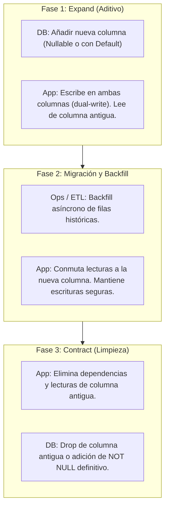

# Migration Rollback & Expand/Contract Policy — CircleSfera

> **Source of Truth:** Este documento establece las reglas obligatorias de diseño, despliegue
> y reversión de migraciones de base de datos en PostgreSQL (Prisma) para CircleSfera. Garantiza
> que cualquier despliegue pueda revertirse (rollback) sin provocar fallos en cascada por
> desalineación de esquema.

---

## 1. Principio Fundamental: Coexistencia N-1

En el ciclo de despliegue continuo de CircleSfera, `prisma migrate deploy` se ejecuta durante el
arranque de los contenedores antes de que el nuevo código comience a recibir tráfico. Si una versión
de la aplicación falla en sus verificaciones de salud y se ejecuta un rollback al artefacto previo
(versión $N-1$), la base de datos permanecerá en el esquema migrado (versión $N$).

> **Regla de Oro:** Todo cambio de esquema en versión $N$ debe ser **100% compatible** con el código
> de la aplicación en versión $N-1$. Ningún rollback de aplicación debe requerir una reversión
> destructiva inmediata de la base de datos para seguir operando con normalidad.

---

## 2. Ciclo de Vida Expand/Contract (Tres Fases)

Cualquier modificación estructural que modifique o elimine datos existentes debe dividirse en fases
independientes a lo largo de despliegues sucesivos:



### Fase 1 — Expand (Despliegue N)
- Se añade la nueva columna como `NULLABLE` o con un valor `DEFAULT` estricto a nivel de base de datos.
- El código de la aplicación escribe en ambos campos (dual-write) pero continúa leyendo de la estructura original.
- **Capacidad de Rollback:** Si se revierte el código a $N-1$, la versión anterior simplemente ignora la nueva columna.

### Fase 2 — Backfill & Switch (Despliegue N+1)
- Se ejecuta un script o job en segundo plano para poblar los registros históricos en la nueva columna.
- El código de la aplicación conmuta sus lecturas a la nueva columna una vez completado el backfill.
- **Capacidad de Rollback:** Si se revierte el código, la columna original sigue intacta y sincronizada por el dual-write.

### Fase 3 — Contract (Despliegue N+2)
- Una vez verificado en producción que ninguna instancia lee ni depende de la columna antigua, una nueva migración elimina la columna obsoleta (`DROP COLUMN`) o añade restricciones definitivas.
- **Capacidad de Rollback:** Requiere una ventana de estabilidad previa confirmada.

---

## 3. Catálogo de Operaciones Prohibidas en un Solo Paso

Quedan expresamente prohibidas en una única migración las siguientes sentencias destructivas o restrictivas:

| Operación SQL | Riesgo para Versión $N-1$ | Alternativa Expand/Contract Requerida |
| :--- | :--- | :--- |
| `DROP COLUMN` directo | Fallo inmediato si la versión $N-1$ intenta leer o proyectar la columna. | Desacoplar lecturas en $N$, eliminar en $N+1$. |
| `ALTER COLUMN ... RENAME` | La versión $N-1$ fallará al no encontrar el identificador anterior. | Añadir nueva columna, copiar datos y retirar antigua en 3 fases. |
| `ADD COLUMN ... NOT NULL` (sin `DEFAULT`) | La versión $N-1$ insertará registros sin el nuevo campo, violando la restricción NOT NULL. | Añadir como `NULLABLE` o con `DEFAULT` válido en la base de datos. |
| `DROP TABLE` activa | Imposibilita el rollback a cualquier versión que consulte dicha tabla. | Retirar todas las consultas en código primero; drop en release posterior. |
| `ALTER TYPE ... DROP VALUE` | Falla si existen filas históricas o si la versión $N-1$ emite dicho valor enum. | Deprecar valor en backend; limpiar datos antes de recrear el tipo enum. |

---

## 4. Procedimientos Operativos de Rollback

### Estrategia A: Rollback de Aplicación (Canónica y Recomendada)
Al cumplir con la disciplina Expand/Contract, la reversión operativa estándar no toca la base de datos:
1. Revertir el despliegue del contenedor a la versión anterior de la imagen Docker:
   ```bash
   docker compose -f docker-compose.prod.yml up -d --no-deps backend frontend
   ```
2. Verificar en `/api/v1/health` que la versión $N-1$ responde con normalidad.
3. El esquema $N$ permanece en la base de datos sin generar errores ni bloqueos.

### Estrategia B: Rollback de Esquema de Base de Datos (Incidencia Crítica)
Si una migración produce bloqueos de tabla prolongados (locks), corrupción de índices o errores de sintaxis en producción:
1. Localizar el script de reversión `down.sql` correspondiente a la migración afectada en `prisma/migrations/<timestamp_name>/down.sql`.
2. Aplicar el script de reversión contra la base de datos:
   ```bash
   psql "${DATABASE_URL}" -f prisma/migrations/<migration_dir>/down.sql
   ```
3. Marcar la migración como revertida en el registro interno de Prisma para evitar bloqueos futuros:
   ```bash
   npx prisma migrate resolve --rolled-back "<migration_name>"
   ```
4. Confirmar el estado limpio del historial:
   ```bash
   npx prisma migrate status
   ```

---

## 5. Herramientas de Automatización y CI

CircleSfera proporciona dos comandos canónicos para validar esta política:

1. **Linter Estático de Migraciones (`npm run db:lint-migrations`)**:
   Analiza automáticamente los archivos `.sql` bajo `prisma/migrations/` en busca de sentencias destructivas (`DROP COLUMN`, `RENAME`, `SET NOT NULL` sin default) advirtiendo antes de integrar en `main`.

2. **Simulacro de Rollback en Base Aislada (`npm run db:test-rollback`)**:
   Ejecuta las migraciones en una base de datos efímera, aplica la migración objetivo, ejecuta su `down.sql`, valida que el esquema retorne exactamente al estado $N-1$ y recompueba la reaplicación hacia adelante.
