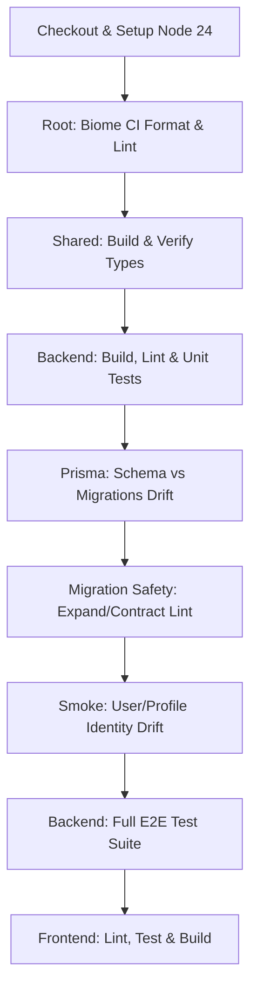
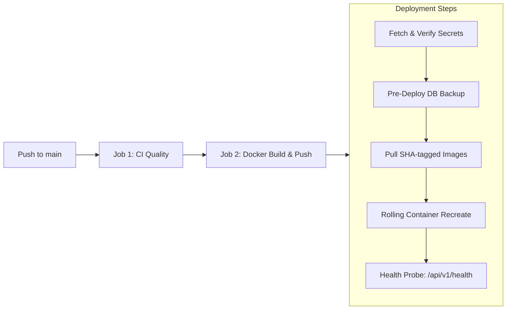

# CircleSfera: Production Change Control Policy

This document defines the production change control rules, branch protection standards, and deployment gating mechanisms for CircleSfera.

---

## 1. Principles of Production Change Control

All changes impacting production systems must adhere to four strict principles:

1. **No Direct Production Pushes:** The `main` branch represents deployable production state. Direct pushes to `main` are blocked; all code changes must originate from branch pull requests.
2. **Mandatory Peer Review:** Pull requests require at least one approving review from a repository maintainer before merge eligibility.
3. **Mechanical Verification Before Merge:** Changes must pass all automated CI Quality and Smoke checks. Status checks cannot be skipped or bypassed.
4. **Gated and Monitored Deployments:** Production rollouts to the OVH VPS are sequentially dependent on CI test success, require automated pre-deploy backups, and perform active health validation before release completion.

---

## 2. GitHub Branch Protection Matrix (`main`)

The `main` branch enforces the following protection rules via GitHub API:

| Rule Category | Configuration Setting | Target Value | Operational Impact |
| :--- | :--- | :---: | :--- |
| **Admin Enforcement** | `enforce_admins` | `true` | Policy applies equally to repository administrators. |
| **Destructive Actions** | `allow_force_pushes` | `false` | Force pushes (`git push --force`) are permanently prohibited. |
| **Branch Lifecycle** | `allow_deletions` | `false` | The `main` branch cannot be deleted. |
| **Pull Request Reviews** | `required_approving_review_count` | `1` | At least one approving review required before merge. |
| **Stale Review Invalidation**| `dismiss_stale_reviews` | `true` | New commits automatically invalidate previous approvals. |
| **Discussion Resolution** | `required_conversation_resolution` | `true` | All comment threads must be resolved before merging. |
| **Required Status Checks** | `contexts` | Enforced | Pull requests must pass designated status checks. |

### Canonical Required Status Checks

The following checks are registered as required contexts:
1. `Run Lint and Unit Tests / Run Lint and Unit Tests` (triggered from `.github/workflows/ci-quality.yml`).
2. `Playwright Smoke (unauthenticated)` (triggered from `.github/workflows/pr.yml`).

---

## 3. Continuous Integration Quality Gates

Before code can be merged into `main`, `.github/workflows/ci-quality.yml` executes the comprehensive quality pipeline:



- **Biome CI:** Strict linting and formatting compliance without ad-hoc rules.
- **Backend Unit Tests:** 155 test suites, 1,180+ tests passing with zero failures.
- **Migration Drift & Safety:** Asserts zero drift between `schema.prisma` and migrations (`check-prisma-schema-migrations.sh`), and validates that migrations do not execute destructive single-step operations (`lint-migration-safety.mjs`).
- **Identity Drift Smoke:** Asserts that `User` and `Profile` separation contracts conform to ADR-0015.
- **Backend E2E Suite:** Runs complete API scenarios against live PostgreSQL (`pgvector`) and Redis service containers.
- **Frontend Build:** Validates TypeScript compilation and production bundle generation.

---

## 4. Production Deployment Gates (`deploy.yml`)

Deployments to the OVH VPS execute via GitHub Actions under `.github/workflows/deploy.yml`:



### Deployment Safeguards

1. **Concurrency Lock:**
   `concurrency: { group: deploy-production, cancel-in-progress: false }`. Only one deployment may proceed at any moment. Incoming deployments queue; active deployments are never aborted mid-SSH rollout.
2. **Pipeline Dependency:**
   The `build` job depends on `test` (`needs: test`). The `deploy` job depends on `build` (`needs: build`). If any lint, test, or security check fails, images are never built and the VPS is never touched.
3. **Secrets Verification:**
   Validates base64 environment payload (`ENV_PRODUCTION_B64`), minimum secret lengths (`ABUSE_HASH_PEPPER >= 32` characters), and critical API keys (`TURNSTILE_SECRET_KEY`, `REDIS_PASSWORD`).
4. **Pre-Deploy Database Backup:**
   Before recreating application containers or applying migrations, the deployment job triggers an automated logical dump:
   `/srv/circlesfera/backups/postgres/pre_deploy_<SHA>_<TIMESTAMP>.dump`.
5. **Post-Deployment Health Probe & Automated Rollback:**
   The deploy script polls `https://api.circlesfera.com/api/v1/health`. If the endpoint fails to return HTTP 200 within the timeout window, the script automatically reverts container tags to the previous release SHA (`PREV_SHA`).

---

## 5. Verification & Audit Tooling

CircleSfera provides automated CLI tooling to audit and maintain branch protection rules:

```bash
# Verify all protection rules (returns exit code 0 on compliance, 1 on violation)
npm run repo:verify-protection

# Output structured JSON results for automated compliance auditing
node scripts/verify-branch-protection.mjs --json

# Synchronize and enforce rules against the repository
npm run repo:enforce-protection
```

---

## 6. Emergency Break-Glass Procedure

In the rare event of an active P0 incident requiring an immediate emergency hotfix:

1. **Incident Declaration:** The Incident Commander (IC) logs the incident in the incident response channel.
2. **Hotfix Branch:** Create a dedicated branch `hotfix/<incident-id>`.
3. **Minimum Gate:** The CI Quality test job must still pass on the hotfix branch prior to merge.
4. **Post-Incident Audit:** Within 24 hours of resolution, the change must undergo a retrospective audit, updating ADRs and test suites to prevent recurrence.
