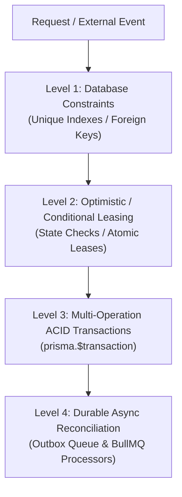

# Transaction Boundaries and Concurrency Invariants — CircleSfera

> **Source of Truth:** This document defines the transactional boundaries, concurrency controls, and database invariant strategies enforced across CircleSfera.

---

## 1. Scope and Purpose

In a distributed, high-concurrency social and financial platform, race conditions and dual-write inconsistencies can lead to critical failures:
1. **Financial Discrepancies:** Double-crediting or duplicate processing of webhook notifications, incorrect platform fee distribution (ADR-0010), or unrecorded creator payouts.
2. **Relationship Desynchronization:** Duplicate follow relationships, simultaneous block/follow anomalies, or corrupted mute durations.
3. **Lifecycle & Privacy Leakage:** Partial account deletions leaving orphaned personal data, or duplicate concurrent GDPR data export requests overwhelming compute infrastructure.

CircleSfera enforces a strict multi-layered strategy ensuring that every critical domain transition is protected by explicit atomicity, lease locking, or database-level constraints.

---

## 2. Invariant Strategy Hierarchy

Critical state transitions utilize a four-level defense-in-depth model:

### 2.1 Level 1: Database Constraints (Schema Invariants)
- **Unique Compound Indexes:**
  - `Follow`: `@@unique([followerId, followingId])`
  - `Block`: `@@unique([blockerId, blockedId])`
  - `Mute`: `@@unique([muterId, mutedId])`
  - `PostUnlock`: `@@unique([postId, userId])`
  - `StoryUnlock`: `@@unique([storyId, userId])`
  - `MessageUnlock`: `@@unique([messageId, userId])`
  - `WebhookEvent`: `@@unique([externalId])`
- Database-enforced uniqueness guarantees that concurrent identical operations fail fast at the database layer without creating corrupted duplicate rows.

### 2.2 Level 2: Optimistic & Conditional Leasing
- **Webhook Processing Lease:**
  - When concurrent webhook deliveries arrive for the same Stripe event, the database record is leased atomically with a strict lease timeout (`WEBHOOK_LEASE_DURATION_MS = 60_000ms`).
  - If a concurrent worker encounters a unique constraint violation (`P2002`), it re-checks the state and safely yields execution without duplicate side effects.

### 2.3 Level 3: Multi-Operation ACID Transactions (`prisma.$transaction`)
- Operations involving financial ledgers, balance modifications, or multi-table lifecycle cascades must execute within an interactive transaction.
- If any internal assertion or sub-operation fails, the entire transaction rolls back cleanly, leaving zero orphaned state.

### 2.4 Level 4: Durable Async Reconciliation
- Financial reconcilers (`reconcileStuckWebhookEvents`) and BullMQ background workers periodically scan for hung transactions or unhandled events, ensuring eventual consistency.

---

## 3. Domain-Specific Invariants and Controls

### 3.1 Monetization & Creator Economy
- **Platform Fee Atomicity (ADR-0010):**
  - All direct tipping, pay-per-view post unlocks, and story unlocks enforce a strict 20% platform fee deduction (`PLATFORM_FEE_DECIMAL = 0.20`).
  - Creator payouts (80%) and platform commissions (20%) are atomically committed alongside payment session generation or ledger logging.
- **Pay-Per-View Unlock Idempotency:**
  - Unlocks check existing entitlement before invoking payment gateways.
  - Authors are prevented from purchasing their own locked content (`ErrorCode.CANNOT_BUY_OWN_CONTENT`).
- **Creator Stripe Connect Prerequisite:**
  - Transactions reject immediately if the recipient creator has not configured their Stripe Connect account (`ErrorCode.CREATOR_STRIPE_NOT_SETUP`).

### 3.2 Stripe Webhook Processing & Concurrency
- **Duplicate Event Discard:**
  - Events with status `PROCESSED` are immediately short-circuited (`{ received: true }`).
- **P2002 Concurrency Resolution:**
  - Simultaneous webhook deliveries for the same event trigger `P2002` error handling: the second delivery inspects the active lease and yields without duplicate email dispatch or subscription modification.

### 3.3 Relationship Network
- **Self-Action Prevention:**
  - Requests to follow, block, or tip self are rejected upfront in domain logic before querying relational tables.
- **Mutual Block Isolation:**
  - When User A blocks User B, follow actions between both parties are blocked. Target user lookups mimic a 404 (`USER_NOT_FOUND`) to prevent leaking user existence to blocked actors.

### 3.4 Live Streaming
- **Stream State Machine:**
  - Transitions adhere to `PENDING` -> `LIVE` -> `ENDED`.
  - Ending a live stream executes within a transaction to record final duration, peak viewer count, and reward distribution without double-finalization.

### 3.5 Account Lifecycle & GDPR Compliance
- **Account Deletion Purgatory (30-Day Window):**
  - Deletion requests set `deletedAt` within an atomic transaction, revoking active sessions and marking profiles for cascade.
  - Hard deletion removes associated posts, messages, media files, and relationships within a transactional boundary, maintaining financial records per retention policy (LIFE-005).
- **Data Export Job Atomicity:**
  - Data export requests transition through `PENDING` -> `PROCESSING` -> `READY` / `FAILED`.
  - Duplicate export requests within active windows are rejected to protect server resources.

---

## 4. Verification and Automated Testing

All transaction boundaries and concurrency invariants are validated through automated unit and integration test suites:
- `src/common/testing/transaction-invariants.spec.ts`: Validates rollback safety, platform fee math (ADR-0010), pay-per-view unlock guards, webhook P2002 race resolution, and follow network uniqueness.
- `test/money-flows.e2e-spec.ts`: End-to-end integration testing of checkout, webhooks, and monetization gates.
- `src/payments/payments.service.spec.ts`: Unit verification of webhook event processing and lease recovery.
