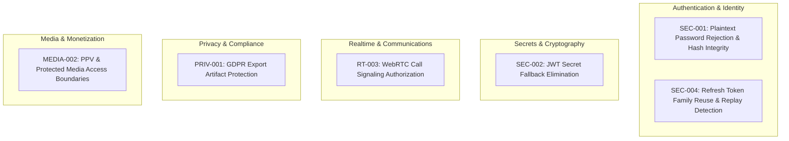

# Security Regression Suite and Vulnerability Prevention — CircleSfera

> **Source of Truth:** This document formalizes the automated security regression architecture, defense-in-depth boundaries, and vulnerability prevention policies covering all resolved P0 and P1 security defects in CircleSfera.

---

## 1. Scope and Purpose

Security hardening in high-traffic social platforms requires permanent automated verification against known defect patterns. Without automated regression barriers, subsequent code refactors, dependency updates, or feature additions risk silently reintroducing previously resolved vulnerabilities.

This document and its accompanying automated regression suite ensure:
1. **Zero Regression for Critical Defects:** Every resolved P0/P1 security finding is accompanied by permanent, non-flaky automated regression tests.
2. **Fail-Closed Security Posture:** Authentication, authorization, token verification, and media access fail closed by default if inputs, configurations, or database records are malformed or missing.
3. **Continuous Enforcement:** Security regression tests run in continuous integration pipelines on every pull request and commit to `main`.

---

## 2. Catalog of Covered Security Findings

The regression suite permanently guards against regressions in the following six foundational security domains:



| Domain | Issue ID | Severity | Category | Target Invariant |
| :--- | :--- | :--- | :--- | :--- |
| **Auth** | `SEC-001` | P0 | Authentication | Strict Argon2/Bcrypt hash verification; plaintext passwords and unrecognized formats fail closed; malformed hashes handled safely. |
| **Secrets** | `SEC-002` | P0 | Cryptography | Zero hardcoded fallback secrets in token verification or generation; missing `JWT_SECRET` fails closed immediately. |
| **Sessions** | `SEC-004` | P1 | Token Lifecycle | RFC 6819 token family reuse detection; replaying rotated refresh tokens revokes the entire token family. |
| **Realtime** | `RT-003` | P1 | Authorization | Stateful WebRTC signaling authorization; self-calls, blocked contacts, busy peers, and unauthorized third parties rejected. |
| **Privacy** | `PRIV-001` | P1 | Data Protection | GDPR export archives protected by cryptographic HMAC tokens; cross-user downloads, unauthenticated requests, and expired links rejected. |
| **Media** | `MEDIA-002` | P1 | Access Control | Pay-Per-View and private post media inaccessible without verified entitlement; static uploads routes block export archives. |

---

## 3. Invariant Details and Remediation Mechanics

### 3.1 SEC-001: Password Authentication & Plaintext Fallback Prevention
- **Vulnerability Vector:** Legacy authentication paths that fall back to direct plaintext string comparison or fail open when encountering legacy database records.
- **Enforced Invariant:**
  - Password hashes must strictly start with modern `$argon2` prefixes or legacy `$2b$`, `$2a$`, `$2y$` Bcrypt prefixes.
  - Plaintext passwords or unrecognized hash algorithms log a warning and immediately fail closed (`isPasswordValid = false`), returning `UnauthorizedException('Invalid credentials')`.
  - Malformed hash strings that cause hashing libraries to throw are caught internally without generating unhandled 500 server errors.
  - Legitimate legacy Bcrypt logins are automatically and transparently upgraded to Argon2 on successful authentication.

### 3.2 SEC-002: JWT Secret Fallback Elimination
- **Vulnerability Vector:** Using default fallback literal strings (e.g. `'secret'`, `'default-key'`, `'circlesfera-appeal-secret'`) when configuration variables (`JWT_SECRET`, `JWT_REFRESH_SECRET`) are missing in production.
- **Enforced Invariant:**
  - All token verification and generation routines invoke `configService.getOrThrow<string>('JWT_SECRET')`.
  - If configuration keys are missing, the system aborts with an explicit configuration error and throws `UnauthorizedException` to the client. Under no circumstances is a fallback literal secret used.
  - Appeal tokens strictly require `isAppealToken: true` in the JWT payload; standard access tokens cannot bypass appeal guards.

### 3.3 SEC-004: Refresh Token Family Reuse & Replay Invalidation (RFC 6819)
- **Vulnerability Vector:** Token replay attacks where an attacker steals a previously used refresh token and exchanges it for new credentials.
- **Enforced Invariant:**
  - Every refresh token is tracked by a cryptographic hash and linked to a unique `familyId`.
  - When a refresh token is presented whose database record is already marked `isRevoked: true`, the server classifies the event as an active replay attack.
  - The entire token family associated with that `familyId` is immediately revoked and deleted from the database, invalidating all concurrent sessions for that compromised lineage.
  - Legitimate rotation marks the previous token as revoked and issues a new token child within the same `familyId`.

### 3.4 RT-003: WebRTC Call Signaling Authorization
- **Vulnerability Vector:** Injecting unauthorized signaling packets, initiating calls to blocked users, or eavesdropping on private call sessions without mutual consent.
- **Enforced Invariant:**
  - Self-calling attempts are rejected upfront (`SELF_CALL`) before querying database relationships.
  - If a mutual `Block` relationship exists between caller and callee, call initiation is rejected (`BLOCKED`).
  - Initiating a call requires an existing, active 1-on-1 direct message conversation between both profiles (`NO_CONVERSATION`).
  - If either participant is already engaged in an active or ringing call, new call attempts are rejected (`BUSY`).
  - WebRTC signaling packets (SDP offers, answers, ICE candidates) are verified against the active session peers; third-party injection is completely rejected.

### 3.5 PRIV-001: GDPR Export Artifact Protection
- **Vulnerability Vector:** Unauthenticated access or IDOR vulnerabilities allowing User B to download User A's exported personal archive.
- **Enforced Invariant:**
  - Downloading export files requires either an active authenticated user session matching the archive owner or a cryptographically signed HMAC download token.
  - Tokens are verified using constant-time timing-safe buffer comparison (`crypto.timingSafeEqual`).
  - Mismatched user IDs or request IDs in the token payload trigger `ForbiddenException`.
  - Download attempts for expired archives return `HTTP 410 Gone`.
  - Direct access to `/uploads/exports/*` via static media controllers is explicitly forbidden.

### 3.6 MEDIA-002: Protected & Pay-Per-View Media Access Boundaries
- **Vulnerability Vector:** Directly retrieving pay-per-view images/videos via predictable static URLs without purchasing an unlock.
- **Enforced Invariant:**
  - Unauthenticated visitors are blocked from all premium, followers-only, or private media.
  - Access to media flagged with `isPremium: true` requires an active `PostUnlock` database record matching `(userId, postId)`.
  - Content authors always retain access to their own media regardless of PPV or privacy settings.
  - Content scoped to `FOLLOWERS` requires an accepted follow relationship (`FollowStatus.ACCEPTED`).
  - Content scoped to `PRIVATE` requires mutual close-friends entitlement.
  - Public, non-premium media remains accessible to all visitors.

---

## 4. Verification and Automated Testing

All security regression assertions are implemented in a standalone, hermetic test suite:
- **Suite File:** `circlesfera-backend/src/common/testing/security-regression.spec.ts`
- **Execution Command:**
  ```bash
  npm test -- src/common/testing/security-regression.spec.ts
  ```
- **Test Count:** 27 automated unit regression specifications covering all 6 findings.
- **Performance:** Execution time $\le 1.5$s using mocked Prisma and Redis adapters.

---

## 5. Ongoing Enforcement in CI/CD

The security regression suite is executed in the automated quality pipeline (`.github/workflows/ci-quality.yml`) as part of the `npm test` gate. Any modification to auth, token generation, WebRTC signaling, GDPR export, or media authorization that breaks these invariants causes immediate CI failure, blocking merge into `main`.
