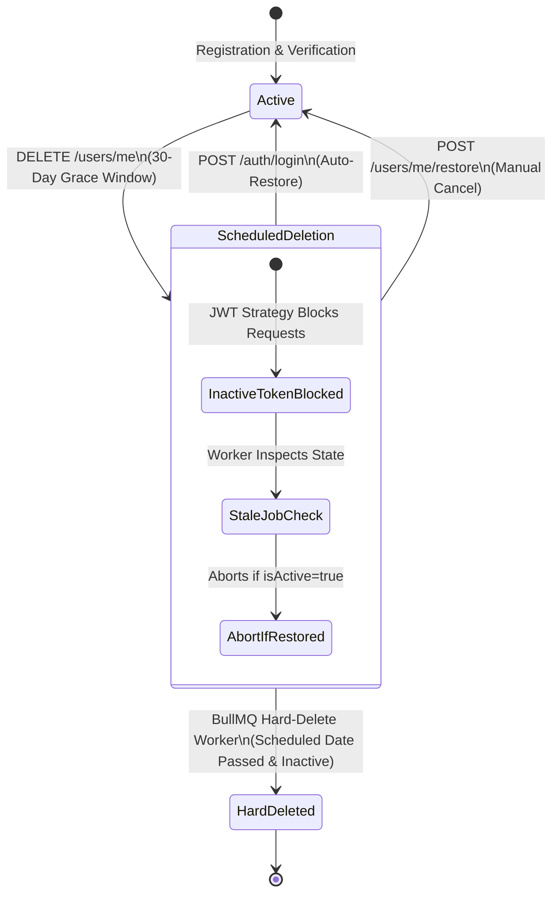

# Lifecycle, Deletion Race, and Authorization E2E Specification — CircleSfera

> **Source of Truth:** This document defines the end-to-end testing topology, lifecycle state machines, deletion race safeguards (LIFE-001), and horizontal authorization (IDOR) boundaries across CircleSfera.

---

## 1. Scope and Purpose

In social platforms with high concurrent interactions, critical defects frequently emerge at the intersection of account lifecycle and resource ownership:
1. **Deletion Races (LIFE-001):** Asynchronous background workers executing scheduled hard-deletes can race against user account restoration or cancellation, risking the permanent destruction of active or restored accounts.
2. **Incomplete Grace Periods:** Lack of atomic state isolation during deletion grace periods allows deactivated users to continue modifying resources or, conversely, prevents legitimate users from restoring their accounts upon login.
3. **Horizontal Privilege Escalation (IDOR):** Endpoints that modify or delete resources (posts, comments, settings) without strictly verifying resource ownership against the authenticated profile ID.

CircleSfera enforces a dual-tier testing and enforcement architecture combining hermetic unit invariant checks with live end-to-end integration journeys.

---

## 2. Architecture & Invariant Hierarchy



### 2.1 Account Deletion Grace Period & Restoration
- **Scheduling Deletion (`DELETE /api/v1/users/me`):**
  - Sets `scheduledDeletionAt = now + 30 days`, `deletedAt = now`, and `isActive = false` within an atomic Prisma transaction.
  - Enqueues a delayed hard-deletion job via the Transactional Outbox pattern (`OutboxService.enqueue`), eliminating dual-write failure gaps.
- **Deactivation Enforcement:**
  - `JwtStrategy` inspects `user.isActive` on every authenticated request. Deactivated tokens immediately receive `401 Unauthorized ('User not found or account deactivated')`.
- **Restoration via Login:**
  - When credentials are valid for a user with `isActive === false` and `scheduledDeletionAt > new Date()`, `AuthService.login` auto-restores the account:
    - Sets `isActive = true`, `deletedAt = null`, `scheduledDeletionAt = null`.
    - Cancels or removes the pending hard-delete job from `usersQueue`.
    - Issues active session tokens, fully restoring access.

### 2.2 Deletion Race Protection (LIFE-001)
- **Stale Job Invalidation:**
  - When the BullMQ processor (`AccountDeletionProcessor.hardDeleteUser`) activates, it never assumes the account is still due for deletion based on job payload alone.
  - It performs a fresh database lookup of the `User` record immediately before any destructive work.
  - If `user.isActive === true` or `!user.deletedAt && !user.scheduledDeletionAt`, the job aborts immediately without touching external payment subscriptions (Stripe) or database cascades.
- **Expired Grace Window Rejection:**
  - If a user attempts to cancel a scheduled deletion after `scheduledDeletionAt <= new Date()`, the request is rejected with `Error('Deletion grace window has expired')`.

### 2.3 Horizontal Authorization & IDOR Boundaries
- **Resource Ownership Validation:**
  - Modifying or deleting posts, comments, stories, or settings validates that the requesting `profileId` matches the resource's owner.
  - Unauthorized modification or deletion attempts return `403 Forbidden`.
  - Non-existent resource lookups return `404 NotFoundException` without revealing ownership existence.
- **Admin Privilege Isolation:**
  - Standard user sessions accessing `/admin/*` routes fail at `AdminJwtAuthGuard`, returning `401 Unauthorized`.

---

## 3. Automated Verification Strategy

Testing is conducted across two complementary layers:

### 3.1 Live E2E Integration Suite
- **File:** `circlesfera-backend/test/security/authorization.security.e2e-spec.ts`
- **Execution:**
  ```bash
  npm run test:e2e -- test/security/authorization.security.e2e-spec.ts
  ```
- **Scope:** Bootstraps NestJS `AppModule` against live PostgreSQL and Redis. Validates cross-user post IDOR, comment IDOR, admin guard isolation, scheduled deletion deactivation, and login auto-restoration journeys with real cookies and CSRF tokens.

### 3.2 Hermetic Invariant Unit Suite
- **File:** `circlesfera-backend/src/common/testing/lifecycle-authorization.spec.ts`
- **Execution:**
  ```bash
  npm test -- src/common/testing/lifecycle-authorization.spec.ts
  ```
- **Scope:** 10 fast unit invariant tests verifying 30-day grace calculation, transactional outbox enqueue, cancellation queue removal, expired grace window rejection, hard-delete worker race abortion, and comment ownership checks.

---

## 4. Continuous Integration Enforcement

Both test suites run in GitHub Actions CI pipelines:
- The unit invariant suite runs on every PR via `npm test` (`ci-quality.yml`).
- The E2E suite runs in the backend integration test gate.
- Code changes violating lifecycle state transitions or cross-user ownership bounds cause immediate pipeline failures.
