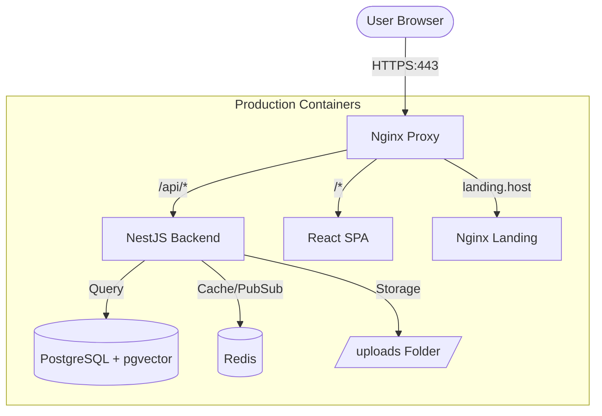

# Project Architecture: CircleSfera

This document provides a high-level overview of the CircleSfera platform architecture.

## 1. System Overview

CircleSfera is built as a set of containerized services orchestrated by Docker Compose.

## 2. Component Layering

### [A] Frontend (circlesfera-frontend)
- **Framework**: React 18 / Vite.
- **Styling**: Tailwind CSS 4.
- **State**: TanStack Query (React Query).

### [B] Backend (circlesfera-backend)
- **Framework**: NestJS (Node.js).
- **ORM**: Prisma 7.
- **Database**: PostgreSQL with `pgvector` for similarity search.

### [C] Landing (circlesfera-landing)
- **Tech**: Static HTML/CSS/JS (Vite).
- **Update Strategy**: Volume-mounted for instant deployment of marketing changes.

### [D] Shared (circlesfera-shared)
- **Purpose**: Unified TypeScript interfaces, DTOs, and validation logic.

## 3. Communication Patterns

- **Synchronous**: Frontend to Backend via REST API (`/api/v1`).
- **Asynchronous**: Real-time updates via Socket.io.
- **Caching**: Shared session and temporary data in Redis.
