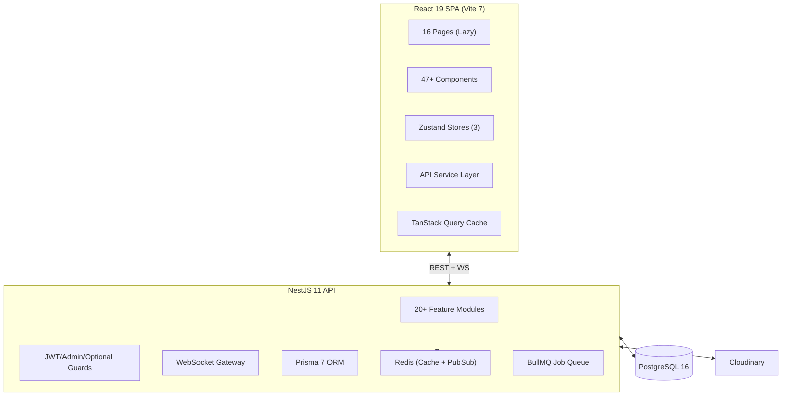

# 🔍 CircleSfera — Comprehensive Audit Report

> **Audit Date:** 2026-02-13  
> **Auditor Role:** Senior Software Architect  
> **Project:** CircleSfera — Full-Stack Social Media Platform  
> **Stack:** NestJS 11 · React 19 · Prisma 7 · PostgreSQL 16 · Vite 7 · Tailwind 4

---

## Executive Summary

CircleSfera is a well-structured Instagram-inspired social platform with a solid modular architecture. The codebase shows evidence of professional development practices — TypeScript throughout, JWT rotation, Argon2 hashing, rate limiting, Swagger docs, and lazy-loaded routes. However, **critical security vulnerabilities**, a very low test coverage, and several performance gaps need immediate attention before any production deployment.

| Category                 |   Score    | Verdict                                                                |
| ------------------------ | :--------: | ---------------------------------------------------------------------- |
| Architecture & Structure |  **8/10**  | ✅ Strong modular NestJS + clean React SPA                             |
| Code Quality             | **6.5/10** | ⚠️ Solid baseline but lint errors, `any` types, and some anti-patterns |
| Security                 |  **4/10**  | 🔴 Critical — hardcoded secrets, localStorage tokens, no CSRF          |
| Performance              |  **6/10**  | ⚠️ Good lazy loading, but no bundle optimization or DB query tuning    |
| Dependencies             | **7.5/10** | ✅ Modern stack, minor cleanup needed                                  |
| Testing                  |  **3/10**  | 🔴 Very low coverage — only auth & a few services tested               |
| Documentation            |  **7/10**  | ✅ Good READMEs, Swagger present, inline docs in auth                  |
| Infrastructure           |  **5/10**  | ⚠️ Docker exists but no CI/CD, no Redis/app compose, no backups        |
| Accessibility & UX       | **5.5/10** | ⚠️ Good loading states, but lacks ARIA, skip links, keyboard nav       |
| 2026 Best Practices      |  **5/10**  | ⚠️ No RSC, no edge computing, no streaming/Suspense boundaries         |

---

## 1. Architecture & Structure

### 1.1 Architecture Overview

### 1.2 Findings

| #   | Finding                                                                                                                                                                             | Severity |
| --- | ----------------------------------------------------------------------------------------------------------------------------------------------------------------------------------- | :------: |
| A1  | ✅ Clean NestJS modular architecture — 20+ well-separated feature modules                                                                                                           |    —     |
| A2  | ✅ Frontend uses `lazy()` + `Suspense` for all page routes                                                                                                                          |    —     |
| A3  | ✅ Monorepo layout with separate `backend/` and `frontend/` packages                                                                                                                |    —     |
| A4  | ⚠️ [services/index.ts](file:///Users/ShadyFeliu/Desktop/Projects/CircleSfera/circlesfera-frontend/src/services/index.ts) is a 404-line "god file" — all 15+ API domains in one file |  Medium  |
| A5  | ⚠️ No shared types package — frontend re-declares 336 lines of types that mirror Prisma models                                                                                      |  Medium  |
| A6  | ⚠️ Chat API routes don't use `/api/v1/` prefix (inconsistent with rest of API)                                                                                                      |   Low    |
| A7  | ⚠️ `CloseFriend` model lacks `@relation` to the friend `User` — only stores `friendId` as a raw string                                                                              |  Medium  |
| A8  | ⚠️ Deprecated fields (`mediaUrl`, `mediaType`) still on `Post` model alongside new `PostMedia[]`                                                                                    |   Low    |

### 1.3 Action Plan

| Task                                                                                        | Effort | Priority |
| ------------------------------------------------------------------------------------------- | ------ | -------- |
| Split `services/index.ts` into per-domain files (`authService.ts`, `postsService.ts`, etc.) | 2h     | Medium   |
| Create shared types package or auto-generate frontend types from Prisma schema              | 4h     | Medium   |
| Standardize chat routes to use `/api/v1/chat/` prefix                                       | 1h     | Low      |
| Add proper `@relation` to `CloseFriend.friendId`                                            | 30m    | Medium   |
| Plan migration to remove deprecated `Post.mediaUrl`/`mediaType`                             | 2h     | Low      |

---

## 2. Code Quality

### 2.1 Findings

| #   | Finding                                                                                                                                                                                 | Severity |
| --- | --------------------------------------------------------------------------------------------------------------------------------------------------------------------------------------- | :------: |
| C1  | ✅ TypeScript strict mode enabled in both projects                                                                                                                                      |    —     |
| C2  | ✅ Auth service has excellent JSDoc documentation with `@param`, `@returns`, `@throws`                                                                                                  |    —     |
| C3  | ✅ Global exception filter provides consistent error responses                                                                                                                          |    —     |
| C4  | 🔴 6 ESLint errors in frontend — `setState` in effects, undescribed `@ts-expect-error`, `any` types                                                                                     |   High   |
| C5  | ⚠️ Admin guard uses `eslint-disable` comments to suppress type errors instead of proper typing                                                                                          |  Medium  |
| C6  | ⚠️ `handleError` function in [services/index.ts](file:///Users/ShadyFeliu/Desktop/Projects/CircleSfera/circlesfera-frontend/src/services/index.ts#L59-L61) is a no-op — just re-rejects |   Low    |
| C7  | ⚠️ `socketStore.ts` has 233 lines — mixing connection, reconnection, token refresh, and event handling                                                                                  |  Medium  |
| C8  | ⚠️ Imports in `services/index.ts` are scattered (import at top, middle L13, and L275)                                                                                                   |   Low    |
| C9  | ⚠️ Non-null assertion `token!` in [socketStore.ts](file:///Users/ShadyFeliu/Desktop/Projects/CircleSfera/circlesfera-frontend/src/stores/socketStore.ts#L83)                            |   Low    |
| C10 | ⚠️ `CreatePostModal.tsx` is 33KB — likely needs decomposition                                                                                                                           |   High   |

### 2.2 Metrics

| Metric               | Actual                          | Benchmark 2026       |
| -------------------- | ------------------------------- | -------------------- |
| Lint Errors          | 6 errors, 1 warning             | 0                    |
| Largest Component    | 33KB (`CreatePostModal`)        | < 10KB               |
| Largest Service File | 404 lines (`services/index.ts`) | < 200 lines          |
| `any` Type Usage     | Present in Settings.tsx, guards | 0                    |
| JSDoc Coverage       | Auth only (~10%)                | > 60% critical paths |

### 2.3 Action Plan

| Task                                                                                    | Effort | Priority |
| --------------------------------------------------------------------------------------- | ------ | -------- |
| Fix all 6 ESLint errors (`setState` in effects → `useMemo`/initial state)               | 2h     | High     |
| Decompose `CreatePostModal.tsx` into sub-components (StepUpload, StepEdit, StepPublish) | 4h     | High     |
| Remove no-op `handleError`, fix scattered imports                                       | 30m    | Low      |
| Split `socketStore.ts` — extract token refresh logic into utility                       | 2h     | Medium   |
| Add proper types to admin guard instead of eslint-disable                               | 30m    | Medium   |

---

## 3. Security & Vulnerabilities

> [!CAUTION]
> **CRITICAL:** The `.env` file contains hardcoded database credentials (`Amazonico1198`) and is not in `.gitignore`. If this has been committed to Git, credentials are compromised and must be rotated immediately.

### 3.1 Findings

| #   | Finding                                                                                                        |   Severity   |
| --- | -------------------------------------------------------------------------------------------------------------- | :----------: |
| S1  | 🔴 `.env` file with real DB password committed to repository                                                   | **Critical** |
| S2  | 🔴 JWT tokens stored in `localStorage` — vulnerable to XSS attacks                                             | **Critical** |
| S3  | 🔴 No CSRF protection — API relies solely on CORS + Bearer tokens                                              |     High     |
| S4  | ⚠️ JWT secrets are weak dev strings (`dev_secret_key_change_in_production_min_32_chars`)                       |     High     |
| S5  | ✅ Argon2 password hashing with bcrypt migration path                                                          |      —       |
| S6  | ✅ `Helmet` with default CSP, HSTS, X-Frame-Options                                                            |      —       |
| S7  | ✅ 3-tier rate limiting (1s/1min/1hr) via `@nestjs/throttler`                                                  |      —       |
| S8  | ✅ `ValidationPipe` with `whitelist: true` + `forbidNonWhitelisted: true` (prevents mass assignment)           |      —       |
| S9  | ✅ Body parser limit of 1MB (DoS protection)                                                                   |      —       |
| S10 | ✅ Password reset uses silent fail pattern (doesn't reveal user existence)                                     |      —       |
| S11 | ✅ Refresh token rotation — old tokens deleted on use                                                          |      —       |
| S12 | ⚠️ `.env.example` doesn't mention Redis credentials, Cloudinary keys, OpenAI keys, or email transport config   |    Medium    |
| S13 | ⚠️ No `SameSite` cookie configuration — tokens should be in HTTP-only cookies, not localStorage                |     High     |
| S14 | ⚠️ Admin route `/admin` is only protected by `ProtectedRoute` (auth check) — no RBAC check on frontend         |    Medium    |
| S15 | ⚠️ WebSocket passes token in both `auth.token` AND `query.token` — query string tokens appear in server logs   |    Medium    |
| S16 | ⚠️ `CORS_ORIGIN` uses wildcard fallback `'http://localhost:5173'` in non-production                            |     Low      |
| S17 | ⚠️ Search API uses query string interpolation (`/search?q=${query}`) — should use `params` for proper encoding |    Medium    |

### 3.2 Metrics

| Metric             | Actual           | Benchmark 2026                   |
| ------------------ | ---------------- | -------------------------------- |
| Token Storage      | localStorage     | HTTP-only + Secure cookies       |
| CSRF Protection    | None             | Double-submit or SameSite=Strict |
| Secrets Management | Hardcoded `.env` | Vault / AWS Secrets Manager      |
| Security Headers   | Helmet defaults  | Helmet + strict CSP policy       |
| Password Hashing   | Argon2id ✅      | Argon2id ✅                      |

### 3.3 Action Plan

| Task                                                                                                | Effort | Priority     |
| --------------------------------------------------------------------------------------------------- | ------ | ------------ |
| 🔴 Rotate ALL credentials (DB password, JWT secrets) — verify `.env` is in `.gitignore`             | 1h     | **Critical** |
| 🔴 Migrate token storage from `localStorage` to HTTP-only cookies with `Secure` + `SameSite=Strict` | 8h     | **Critical** |
| Add CSRF protection (double-submit cookie pattern or NestJS `csurf` middleware)                     | 4h     | High         |
| Generate cryptographically strong JWT secrets (64+ chars)                                           | 30m    | High         |
| Remove `query.token` from WebSocket — use only `auth` header                                        | 1h     | Medium       |
| Fix search API to use `params: { q: query }` instead of string interpolation                        | 30m    | Medium       |
| Create comprehensive `.env.example` with all required variables documented                          | 1h     | Medium       |

---

## 4. Performance & Optimization

### 4.1 Findings

| #   | Finding                                                                                    | Severity |
| --- | ------------------------------------------------------------------------------------------ | :------: |
| P1  | ✅ All page routes lazy-loaded with `React.lazy()` + `Suspense`                            |    —     |
| P2  | ✅ TanStack Query for data caching and deduplication                                       |    —     |
| P3  | ✅ Redis cache module configured in backend                                                |    —     |
| P4  | ✅ BullMQ for background job processing                                                    |    —     |
| P5  | ✅ Database indexes on critical query paths (userId, createdAt, composite)                 |    —     |
| P6  | ⚠️ No Vite manual chunk splitting configuration — bundle may be monolithic                 |  Medium  |
| P7  | ⚠️ `Suspense` only wraps entire app — no granular `Suspense` boundaries per route          |  Medium  |
| P8  | ⚠️ Prisma schema has duplicate indexes (`@@index([userId])` appears twice on `Like` model) |   Low    |
| P9  | ⚠️ No image optimization pipeline (no WebP/AVIF conversion, no responsive srcset)          |   High   |
| P10 | ⚠️ Service layer uses `.catch(handleError)` which is a no-op — errors aren't transformed   |   Low    |
| P11 | ⚠️ Socket reconnection uses `setTimeout` with fixed 500ms delay — no exponential backoff   |  Medium  |
| P12 | ⚠️ `useDebounce` hook exists but unclear if it's used for search input                     |   Low    |

### 4.2 Metrics

| Metric                     | Actual         | Benchmark 2026                    |
| -------------------------- | -------------- | --------------------------------- |
| Route-Level Code Splitting | ✅ All lazy    | ✅                                |
| Component-Level Splitting  | ❌ None        | Modal/heavy components            |
| Image Optimization         | ❌ Raw uploads | WebP + responsive `srcset`        |
| Bundle Analysis            | Not configured | Rollup visualizer                 |
| DB Query Optimization      | Basic indexes  | Covering indexes + query analysis |

### 4.3 Action Plan

| Task                                                                                   | Effort | Priority |
| -------------------------------------------------------------------------------------- | ------ | -------- |
| Add Vite `manualChunks` config to split vendor, react, tanstack-query, socket.io       | 2h     | Medium   |
| Add granular `Suspense` boundaries for heavy components (CreatePostModal, StoryViewer) | 2h     | Medium   |
| Implement image optimization pipeline (Sharp/Cloudinary transforms to WebP)            | 6h     | High     |
| Remove duplicate `@@index([userId])` from `Like` model                                 | 15m    | Low      |
| Add exponential backoff to socket reconnection                                         | 1h     | Medium   |

---

## 5. Dependency Management

### 5.1 Stack Assessment

| Package         | Version | Latest (Feb 2026) | Status          |
| --------------- | ------- | ----------------- | --------------- |
| NestJS          | 11.1.10 | 11.x ✅           | ✅ Current      |
| React           | 19.2.3  | 19.x ✅           | ✅ Current      |
| Prisma          | 7.3.0   | 7.x ✅            | ✅ Current      |
| Vite            | 7.2.4   | 7.x ✅            | ✅ Current      |
| TypeScript (BE) | 5.7.3   | 5.9.x             | ⚠️ Minor behind |
| TypeScript (FE) | 5.9.3   | 5.9.x ✅          | ✅ Current      |
| Tailwind CSS    | 4.1.18  | 4.x ✅            | ✅ Current      |
| Socket.IO       | 4.8.3   | 4.x ✅            | ✅ Current      |

### 5.2 Findings

| #   | Finding                                                                                                      | Severity |
| --- | ------------------------------------------------------------------------------------------------------------ | :------: |
| D1  | ✅ All major dependencies are on latest major versions — excellent                                           |    —     |
| D2  | ⚠️ Both `bcrypt` AND `argon2` are installed — bcrypt is now legacy-only                                      |   Low    |
| D3  | ⚠️ `@types/nodemailer` is in `dependencies` instead of `devDependencies`                                     |   Low    |
| D4  | ⚠️ `@nestjs/mapped-types` uses `*` version — should be pinned                                                |  Medium  |
| D5  | ⚠️ Backend TypeScript is 5.7.3 while frontend is 5.9.3 — version mismatch                                    |   Low    |
| D6  | ⚠️ `socket.io-client` appears in both backend (`dependencies`) and frontend — backend likely doesn't need it |   Low    |
| D7  | ⚠️ `react-audio-player` (last update 2021, 0.17.0) — potentially abandoned                                   |  Medium  |

### 5.3 Action Plan

| Task                                                                                | Effort | Priority |
| ----------------------------------------------------------------------------------- | ------ | -------- |
| Pin `@nestjs/mapped-types` to specific version                                      | 5m     | Medium   |
| Move `@types/nodemailer` to `devDependencies`                                       | 5m     | Low      |
| Update backend TypeScript to 5.9.x to match frontend                                | 30m    | Low      |
| Remove `socket.io-client` from backend if unused                                    | 15m    | Low      |
| Evaluate `react-audio-player` replacement (e.g., custom HTML5 audio or `howler.js`) | 2h     | Medium   |
| Plan bcrypt removal once all users have migrated to argon2                          | 1h     | Low      |

---

## 6. Testing & Coverage

> [!WARNING]
> Testing is the weakest area of the project. Only ~15% of backend services have unit tests and the frontend has essentially 2 test files. This is a significant risk for production deployment.

### 6.1 Test Inventory

**Backend (11 spec files):**

| File                        | Exists | Quality                                                                  |
| --------------------------- | :----: | ------------------------------------------------------------------------ |
| `auth.service.spec.ts`      |   ✅   | Good — 244 lines, covers register, login, verify, reset, refresh, logout |
| `passkey.service.spec.ts`   |   ✅   | Unknown                                                                  |
| `posts.service.spec.ts`     |   ✅   | Unknown                                                                  |
| `comments.service.spec.ts`  |   ✅   | Unknown                                                                  |
| `stories.service.spec.ts`   |   ✅   | Unknown                                                                  |
| `follows.service.spec.ts`   |   ✅   | Unknown                                                                  |
| `chat.service.spec.ts`      |   ✅   | Unknown                                                                  |
| `chat.controller.spec.ts`   |   ✅   | Unknown                                                                  |
| `search.service.spec.ts`    |   ✅   | Unknown                                                                  |
| `search.controller.spec.ts` |   ✅   | Unknown                                                                  |
| `app.controller.spec.ts`    |   ✅   | Unknown                                                                  |

**Frontend (2 test files):**

| File                | Exists | Quality |
| ------------------- | :----: | ------- |
| `PostCard.test.tsx` |   ✅   | Unknown |
| `authStore.test.ts` |   ✅   | Unknown |

**E2E (1 file):**

| File                                  | Exists |
| ------------------------------------- | :----: |
| `e2e/happy-path.spec.ts` (Playwright) |   ✅   |

### 6.2 Critical Gaps

| Missing Test                                                     | Risk Level  |
| ---------------------------------------------------------------- | ----------- |
| No API integration/E2E tests for auth flows                      | 🔴 Critical |
| No tests for WebSocket gateway                                   | High        |
| No tests for file upload pipeline                                | High        |
| No tests for profile/notifications/bookmarks/highlights services | High        |
| No frontend component tests beyond PostCard                      | High        |
| No frontend hook tests                                           | Medium      |
| No frontend store tests beyond authStore                         | Medium      |

### 6.3 Metrics

| Metric                     | Actual           | Benchmark 2026              |
| -------------------------- | ---------------- | --------------------------- |
| Backend Unit Test Coverage | ~15% (estimated) | > 80%                       |
| Frontend Component Tests   | 1 file           | > 60% of components         |
| E2E Tests                  | 1 happy path     | Critical user journeys (5+) |
| Integration Tests          | 0                | All API endpoints           |

### 6.3 Action Plan

| Task                                                                                    | Effort | Priority     |
| --------------------------------------------------------------------------------------- | ------ | ------------ |
| Add integration tests for auth endpoints (register → verify → login → refresh → logout) | 8h     | **Critical** |
| Add tests for posts/comments/likes service layer                                        | 6h     | High         |
| Add tests for WebSocket gateway (connect, messaging, typing, reactions)                 | 6h     | High         |
| Add frontend component tests for core components (StoryViewer, CommentList, ChatWindow) | 8h     | High         |
| Expand E2E suite to cover: registration, posting, following, messaging                  | 12h    | High         |
| Set up code coverage reporting in CI with minimum threshold (80%)                       | 2h     | Medium       |

---

## 7. Documentation

### 7.1 Findings

| #    | Finding                                                                                 | Severity |
| ---- | --------------------------------------------------------------------------------------- | :------: |
| DOC1 | ✅ Root `README.md` (264 lines) — mermaid diagrams, feature table, quick start, backlog |    —     |
| DOC2 | ✅ Backend and Frontend have separate detailed READMEs (10KB+ each)                     |    —     |
| DOC3 | ✅ Swagger/OpenAPI at `/api/docs` with bearer auth support                              |    —     |
| DOC4 | ✅ Auth service has comprehensive JSDoc with `@param`, `@returns`, `@throws`            |    —     |
| DOC5 | ⚠️ Backend service files beyond auth lack JSDoc documentation                           |  Medium  |
| DOC6 | ⚠️ No API versioning documentation or migration guides                                  |   Low    |
| DOC7 | ⚠️ `.env.example` is incomplete — missing Redis, Cloudinary, OpenAI, SMTP config        |  Medium  |
| DOC8 | ⚠️ No CONTRIBUTING.md beyond the basic section in README                                |   Low    |
| DOC9 | ⚠️ No architecture decision records (ADRs)                                              |   Low    |

### 7.2 Action Plan

| Task                                                                                | Effort | Priority |
| ----------------------------------------------------------------------------------- | ------ | -------- |
| Complete `.env.example` with all environment variables and comments                 | 1h     | Medium   |
| Add JSDoc to top 5 critical services (Posts, Chat, Follows, Notifications, Uploads) | 4h     | Medium   |
| Create separate `CONTRIBUTING.md` with coding standards and PR process              | 2h     | Low      |

---

## 8. Infrastructure & DevOps

### 8.1 Findings

| #   | Finding                                                                                          |   Severity   |
| --- | ------------------------------------------------------------------------------------------------ | :----------: |
| I1  | ✅ Multi-stage Dockerfile for backend (build → prod) with `node:22-alpine`                       |      —       |
| I2  | ✅ Frontend Dockerfile exists                                                                    |      —       |
| I3  | ✅ Docker Compose for PostgreSQL with health checks and volume persistence                       |      —       |
| I4  | 🔴 No CI/CD pipeline (`.github/workflows/` is empty or contains only 1 workflow dir with 1 file) | **Critical** |
| I5  | ⚠️ Docker Compose only includes PostgreSQL — no Redis, no application services                   |     High     |
| I6  | ⚠️ No backup strategy documented for PostgreSQL                                                  |     High     |
| I7  | ⚠️ Backend Dockerfile doesn't run `prisma generate` in production stage                          |    Medium    |
| I8  | ⚠️ No health check endpoint in NestJS for container orchestration                                |    Medium    |
| I9  | ⚠️ `version: '3.8'` in docker-compose is deprecated — remove for modern Docker Compose           |     Low      |
| I10 | ⚠️ No production logging configuration (structured logs, log levels, log aggregation)            |    Medium    |

### 8.2 Action Plan

| Task                                                                    | Effort | Priority     |
| ----------------------------------------------------------------------- | ------ | ------------ |
| 🔴 Create GitHub Actions CI pipeline (lint → test → build → deploy)     | 6h     | **Critical** |
| Expand Docker Compose to include Redis, backend, and frontend services  | 3h     | High         |
| Add `/health` endpoint with DB + Redis connectivity checks              | 2h     | Medium       |
| Document PostgreSQL backup strategy (pg_dump cron or managed backups)   | 2h     | High         |
| Add structured logging with Pino/Winston and log levels per environment | 4h     | Medium       |
| Remove deprecated `version` key from `docker-compose.yml`               | 5m     | Low          |

---

## 9. Accessibility & UX

### 9.1 Findings

| #    | Finding                                                                                | Severity |
| ---- | -------------------------------------------------------------------------------------- | :------: |
| UX1  | ✅ Loading states implemented (`LoadingStates.tsx`, spinner in Suspense fallback)      |    —     |
| UX2  | ✅ Error boundary component exists (`ErrorBoundary.tsx`)                               |    —     |
| UX3  | ✅ Empty states handled (`ErrorEmptyStates.tsx`)                                       |    —     |
| UX4  | ✅ Dark mode design system with glassmorphism and brand palette                        |    —     |
| UX5  | ⚠️ No skip-to-content link for keyboard navigation                                     |  Medium  |
| UX6  | ⚠️ `PostMedia` model has `altText` field but unclear if it renders in `` tags |  Medium  |
| UX7  | ⚠️ No `aria-live` regions for real-time notifications/messages                         |  Medium  |
| UX8  | ⚠️ Spinner fallback has no `aria-label` or `role="status"`                             |   Low    |
| UX9  | ⚠️ No visible focus indicators customized for dark theme                               |  Medium  |
| UX10 | ⚠️ No PWA manifest or service worker                                                   |   Low    |

### 9.2 Action Plan

| Task                                                                     | Effort | Priority |
| ------------------------------------------------------------------------ | ------ | -------- |
| Add skip-to-content link and visible focus indicators                    | 2h     | Medium   |
| Audit all `` tags for proper `alt` attributes using `altText` data  | 2h     | Medium   |
| Add `aria-live="polite"` to notification and message containers          | 1h     | Medium   |
| Add `role="status"` and `aria-label` to loading spinners                 | 30m    | Low      |
| Evaluate PWA implementation (manifest.json + service worker for offline) | 4h     | Low      |

---

## 10. 2026 Best Practices

### 10.1 Findings

| #    | Finding                                                                                 | Severity |
| ---- | --------------------------------------------------------------------------------------- | :------: |
| BP1  | ✅ React 19 with latest hooks and Suspense                                              |    —     |
| BP2  | ✅ Vite 7 with SWC for fast builds                                                      |    —     |
| BP3  | ✅ WebAuthn/Passkeys for passwordless auth — excellent 2026 practice                    |    —     |
| BP4  | ✅ AI integration (OpenAI for semantic search/embeddings)                               |    —     |
| BP5  | ⚠️ Not using React Server Components (RSC) — current setup is fully client-rendered SPA |  Medium  |
| BP6  | ⚠️ No Edge functions or edge computing for API responses                                |   Low    |
| BP7  | ⚠️ No streaming SSR or granular Suspense with data loading                              |  Medium  |
| BP8  | ⚠️ No Web Vitals monitoring (CLS, LCP, FID/INP)                                         |  Medium  |
| BP9  | ⚠️ No use of `React.use()` hook for async data in components                            |   Low    |
| BP10 | ⚠️ No content delivery via CDN for static assets and media                              |  Medium  |

### 10.2 Action Plan

| Task                                                                       | Effort | Priority        |
| -------------------------------------------------------------------------- | ------ | --------------- |
| Add Web Vitals monitoring (via `web-vitals` library + analytics dashboard) | 2h     | Medium          |
| Evaluate migration to Next.js or TanStack Start for RSC + streaming SSR    | 40h    | Low (long-term) |
| Set up CDN for Cloudinary assets and static files                          | 3h     | Medium          |
| Add granular Suspense boundaries with skeleton loaders                     | 4h     | Medium          |

---

## 📊 Overall Priority Matrix

### 🔴 Critical (Do First)

1. **Rotate all secrets** — DB password and JWT keys are exposed in committed `.env`
2. **Migrate tokens to HTTP-only cookies** — localStorage is XSS-vulnerable
3. **Set up CI/CD pipeline** — no automated testing or deployment currently
4. **Increase test coverage** — critical auth and API flows are untested

### 🟠 High Priority

5. Fix all 6 ESLint errors in frontend
6. Decompose `CreatePostModal.tsx` (33KB)
7. Add CSRF protection
8. Implement image optimization pipeline
9. Expand Docker Compose with Redis + app services
10. Document backup strategy

### 🟡 Medium Priority

11. Split `services/index.ts` into per-domain files
12. Add shared types between backend/frontend
13. Add comprehensive JSDoc to services
14. Add accessibility improvements (skip link, ARIA, focus)
15. Add Web Vitals monitoring
16. Set up CDN for media assets
17. Add code splitting for vendor chunks

### 🟢 Low Priority

18. Remove deprecated Prisma fields
19. Clean up dependency issues (bcrypt, mapped-types, socket.io-client)
20. Standardize chat API route prefix
21. Evaluate RSC migration path
22. Add PWA support

---

> **Total Estimated Effort for Critical + High items:** ~60-70h  
> **Recommended Sprint Plan:** 2 developers × 2-week sprint focusing on security first, then testing, then infra
