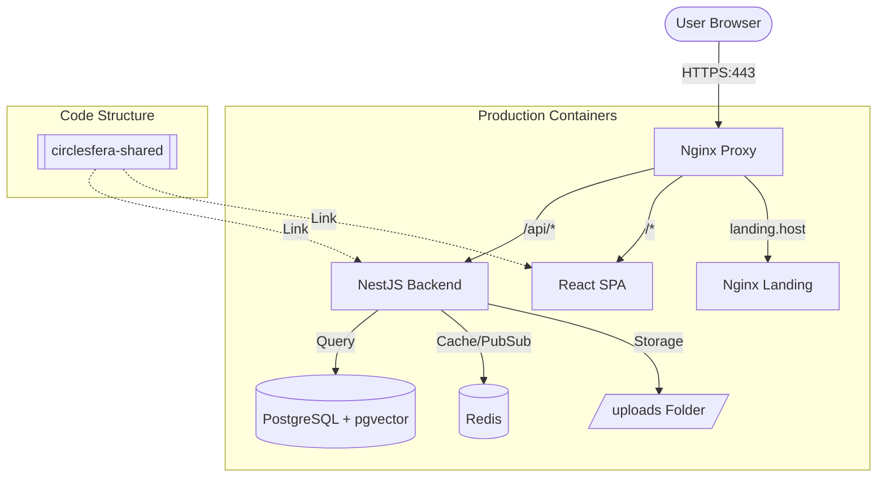

# CircleSfera System Architecture

This document describes the high-level architecture and data flow of the CircleSfera platform.

## 1. Overview Diagram

## 2. Component Breakdown

### [Frontend] (circlesfera-frontend)
- **Tech Stack**: React, Vite, Tailwind CSS, TanStack Query.
- **Responsibility**: Main user application (Feed, Profile, Admin Panel).
- **Deployment**: Served as static files via Nginx within a Docker container.

### [Backend] (circlesfera-backend)
- **Tech Stack**: NestJS, Prisma ORM, TypeScript.
- **Responsibility**: API logic, Authentication (JWT/WebAuthn), Real-time (Socket.io), Database management.
- **Data Layer**: PostgreSQL with `pgvector` for AI/Similarity features.

### [Landing] (circlesfera-landing)
- **Tech Stack**: Static HTML/CSS/JS (Vite).
- **Responsibility**: Public marketing site and user acquisition.
- **Deployment**: Mounted as a volume to a lightweight Nginx container for instant updates.

### [Shared] (circlesfera-shared)
- **Responsibility**: Contains shared TypeScript interfaces, DTOs, and utility functions used by both Frontend and Backend to ensure type safety across the stack.

## 3. Data Flow

1.  **Request Entry**: All external traffic hits the **Nginx Proxy** (CircleSfera-Proxy).
2.  **Routing**:
    -   Requests starting with `/api/v1` are forwarded to the **Backend**.
    -   Standard requests are served by the **Frontend** container.
    -   Landing page traffic is routed to the **Landing** service (depending on host or path configuration).
3.  **Persistence**: The Backend communicates with **PostgreSQL** for relational data and **Redis** for session caching and real-time events.

## 4. Scaling Considerations
- The stateless nature of the Backend and Frontend allows for horizontal scaling of containers behind a load balancer.
- PostgreSQL uses `pgvector`, enabling future implementation of content recommendation systems.
